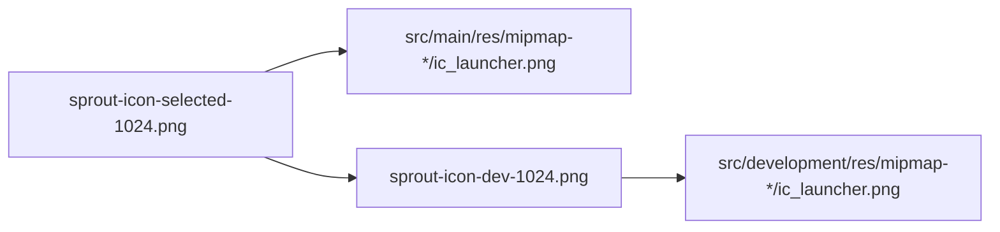

# Wire selected Sprout launcher icons

Use the already-chosen crop [`docs/branding/sprout-icon-selected-1024.png`](docs/branding/sprout-icon-selected-1024.png) as the production launcher. Keep flavors distinguishable by icon as well as by the existing labels (`Sprout` vs `[DEV] Sprout`).

## What exists today

- Manifest points at `@mipmap/ic_launcher` in [`sprout_app/android/app/src/main/AndroidManifest.xml`](sprout_app/android/app/src/main/AndroidManifest.xml).
- Five density PNGs under `sprout_app/android/app/src/main/res/mipmap-*/ic_launcher.png` are still the Flutter logo.
- Flavors in [`sprout_app/android/app/build.gradle.kts`](sprout_app/android/app/build.gradle.kts) only change `app_name`; they share the same icon.
- No iOS/web launcher set. Splash `launch_image` in `launch_background.xml` is commented out — **leave splash alone**.

## Production icon (main)

Resize the 1024 master into the existing mipmap densities and overwrite those files (PNG, opaque, no transparency):

- mdpi 48, hdpi 72, xhdpi 96, xxhdpi 144, xxxhdpi 192

Do not add `flutter_launcher_icons`. One local Pillow (or `sips`) pass, then commit the generated PNGs.

Stay with the current single-layer `ic_launcher.png` setup. Skip adaptive-icon XML in this pass so flavor overrides stay a 1:1 mipmap replace.

## Development icon (flavor overlay)

Android will pick flavor resources over `main`. Add:

`sprout_app/android/app/src/development/res/mipmap-{mdpi,hdpi,xhdpi,xxhdpi,xxxhdpi}/ic_launcher.png`

Generate a second 1024 master first, archive it as [`docs/branding/sprout-icon-dev-1024.png`](docs/branding/sprout-icon-dev-1024.png):

- Same seedling-on-disc mark
- Amber **DEV** band using `AppColors.environmentDev` `#F59E0B` (already the in-app dev banner color)
- Dark text `#0F172A` on a bottom band ~18–22% of the canvas so “DEV” stays readable at 48px
- Band sits inside the square (not a thin edge stroke that Android’s mask will clip)

Then resize that master into the `development` mipmaps.

## Docs

Update the decision log in [`docs/APP_ICON_BRIEF.md`](docs/APP_ICON_BRIEF.md): status becomes implemented; note production vs DEV masters and that splash was not changed.

## Verify

No Dart changes, so skip analyze/test unless something else is dirty. Human check on a device:

1. Install **production** — launcher name **Sprout**, unbadged icon.
2. Install **development** — launcher name **[DEV] Sprout**, amber DEV band.
3. Uninstall/reinstall if the old Flutter icon is cached.