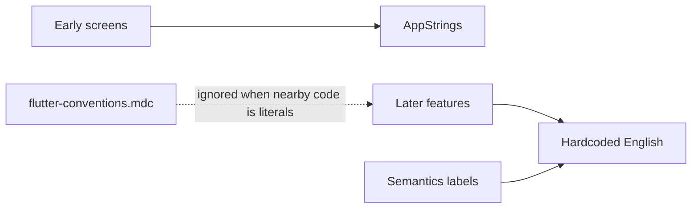

# Centralize user-visible copy in AppStrings

## Why the inconsistency exists

The rule is already written. [`.cursor/rules/flutter-conventions.mdc`](.cursor/rules/flutter-conventions.mdc) says:

> User-visible copy: `AppStrings`. Do not hard-code new UI strings.

[`.cursor/references/architecture.md`](.cursor/references/architecture.md) says the same. It is **not missing**.

It is weakly followed because:

- **`AppStrings` was seeded, not maintained.** Early chrome (tabs, empty states, auth, common actions) went into [`sprout_app/lib/core/constants/app_strings.dart`](sprout_app/lib/core/constants/app_strings.dart). Later work (budget, settings, deposit sheet, recurring, sort menus, intro slides, most Semantics labels) copied nearby widgets and inlined English.
- **Agents copy the file they are editing.** [`goals_page.dart`](sprout_app/lib/features/goals/presentation/goals_page.dart) already uses `AppStrings.goals` for the title, then hardcodes `'Sort goals'` two lines later. [`shell_page.dart`](sprout_app/lib/features/shell/presentation/shell_page.dart) was written against the catalog, so it uses `AppStrings.newAccount`. Local pattern beats the rule.
- **The feature skill only mentions AppStrings for validation**, not UI ([`.cursor/skills/add-flutter-feature/SKILL.md`](.cursor/skills/add-flutter-feature/SKILL.md) step 4). Presentation work has no reminder.
- **Recent Semantics work added a11y/Maestro `label:` strings as literals**, even when the on-screen text already had (or should have) an `AppStrings` constant.

There is no Dart lint for this. Enforcement is convention + making nearby code use `AppStrings` so agents stop seeing literals as the local style.

## What counts as copy (move)

On-screen `Text`, `AppBar` titles, button/chip labels, tooltips, hints, dialog/snackbar copy, Semantics/`label`/`semanticsLabel` (TalkBack/VoiceOver), enum **display** labels (sort, frequency, budget category, transaction kind), and `ValidationAppException` messages.

Keep interpolation at the call site. Extract the English fragments (or a small `static String` helper on `AppStrings` for multi-value sentences). Example: `'${AppStrings.deposit} ${formatZarFromCents(...)}'`, not a new string per amount.

## What does not move

- `SemanticsIds`, widget `Key`s, route paths, Hive/API wire values (`'deposit'`, `'income'`, `'daily'`)
- User-generated names (`a.name`, `g.name`)
- Exception passthrough already using `e.message` after the exception itself uses `AppStrings`

Do **not** introduce ARB / `gen-l10n`. Keep one [`AppStrings`](sprout_app/lib/core/constants/app_strings.dart) class with section comments.

Do **not** change visible English values. Maestro YAML that taps by text stays valid.

## Sweep (reuse existing constants first)

Reuse what already exists (`deposit`, `save`, `cancel`, `delete`, `edit`, `amount`, `selectGoal`, `invalidAmount`, `amountCannotBeNegative`, tab titles, empty-state copy). Add the rest in grouped sections.

Highest-density files:

- Shell / deposit: [`deposit_bottom_sheet.dart`](sprout_app/lib/features/shell/presentation/deposit_bottom_sheet.dart) (mode chips, frequency, date, unallocated, recurring)
- Goals: [`goals_page.dart`](sprout_app/lib/features/goals/presentation/goals_page.dart) (`Sort goals`, `Completed`, card a11y), [`goal_detail_page.dart`](sprout_app/lib/features/goals/presentation/goal_detail_page.dart), [`create_goal_screen.dart`](sprout_app/lib/features/goals/presentation/create_goal_screen.dart), [`unallocated_funds_card.dart`](sprout_app/lib/features/goals/presentation/widgets/unallocated_funds_card.dart), [`goals_sorting.dart`](sprout_app/lib/features/goals/presentation/utils/goals_sorting.dart)
- Accounts: [`accounts_page.dart`](sprout_app/lib/features/accounts/presentation/accounts_page.dart) (`Current` / `Scheduled`), [`account_detail_page.dart`](sprout_app/lib/features/accounts/presentation/account_detail_page.dart)
- Budget: planner, group/item cards, add-group sheet/card, [`budget_sorting.dart`](sprout_app/lib/features/budget/presentation/utils/budget_sorting.dart)
- Transactions / settings / auth intro+sign-in / startup splash+error (dedupe the duplicated `StartupStep` labels in [`startup_page.dart`](sprout_app/lib/features/startup/startup_page.dart) and [`startup_error_page.dart`](sprout_app/lib/features/startup/startup_error_page.dart))
- Shared: [`name_color_form_sheet.dart`](sprout_app/lib/ui/widgets/name_color_form_sheet.dart) (`Color`, `Color N`)

Deduplicate display-label switches that are copy-pasted today:

- `TransactionKind` → `Deposit` / `Allocation` (4 pages)
- Frequency → Daily/Weekly/Monthly/Yearly (sheet + recurring page + [`transaction_frequency_label.dart`](sprout_app/lib/features/transactions/presentation/utils/transaction_frequency_label.dart))
- Budget category → Income / Essentials / Lifestyle

Keep those helper functions; they should return `AppStrings.*`.

Validation leftovers:

- [`create_goal_bloc.dart`](sprout_app/lib/features/goals/presentation/create_goal_bloc.dart) `'Pick an account…'` / `'Opening Balance'`
- [`auth_repository_impl.dart`](sprout_app/lib/features/auth/data/auth_repository_impl.dart) email/code messages

## Tests and Maestro

Update widget tests that assert literals (e.g. [`auth_gate_test.dart`](sprout_app/test/auth/auth_gate_test.dart) `find.text('Sign in')`) to `AppStrings.*`. Auth tests that already use `AppStrings` stay as-is.

Maestro flows: no YAML change if English is unchanged.

## Tighten enforcement so this does not regress

1. Expand the AppStrings bullet in [`.cursor/rules/flutter-conventions.mdc`](.cursor/rules/flutter-conventions.mdc): list the surfaces above; say add the constant first, reuse before inventing; Semantics `label` is copy; domain wire values are not.
2. Add a presentation checklist item in [`.cursor/skills/add-flutter-feature/SKILL.md`](.cursor/skills/add-flutter-feature/SKILL.md): UI strings go in `AppStrings`, including a11y labels.
3. Architecture reference already states the policy — leave it.

No custom lint. After the sweep, nearby code will match the rule.

## Verify

`cd sprout_app && flutter analyze && flutter test` once. Report failures; do not loop.
