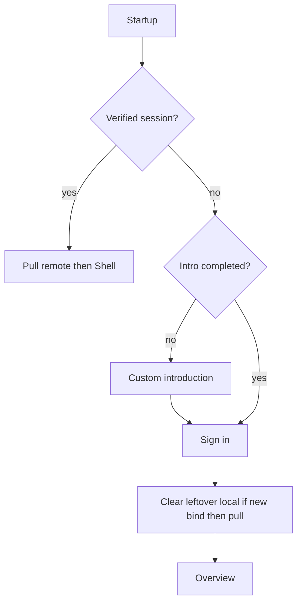

# Auth gate and intro

Split from [auth_intro_gate_9422c9f5.plan.md](auth_intro_gate_9422c9f5.plan.md). **Depends on:** nothing.

Next: [Sign-in display name and Terms](auth_signin_name_terms.plan.md), [Account details and delete](auth_account_details_delete.plan.md).

## Why data vanishes today

Guest writes never enter the pending sync queue. On Google/OTP sign-in, [`AuthService.bindAfterVerifiedSignIn`](../../sprout_app/lib/features/auth/application/auth_service.dart) migrates Hive `userId`s then `flush` + `pullRemote`. Flush is usually empty. If the Google account already has any remote rows, each repo **clears the whole Hive box** and replaces it with cloud data. Sign-out then looks empty because the wipe already happened.

Product change: **do not use the app until signed in.**

## Product rules (locked)

- First launch: custom introduction, then sign-in. Later unsigned launches: sign-in only.
- No guest mode. No creating accounts/goals/transactions until verified.
- After sign-in: pull cloud (empty overview for a new account). **Discard leftover guest Hive** — do not migrate it onto the new uid.
- Same-account re-login: keep local cache, flush pending, pull.
- Different verified account: clear Hive + pending, pull that account.
- Sign-out: session only; return to sign-in. Shell is not reachable while signed out.
- Startup failure: **Retry only** — remove “Continue local-only”.
- Email OTP: optional **display name**. Google: use Google profile name; do not ask again. *(plan 2)*
- Sign-in requires agreeing to Terms (checkbox or “By continuing you agree…” with a tappable Terms link). *(plan 2)*
- In-app **delete account** (Play requirement). Wipes this user’s cloud rows (FK cascade), local Hive, then sign-in. *(plan 3)*

## Out of scope

Display name, Terms, account details UI, delete account.

## Auth gate + intro

Custom `PageView` (dots + last CTA **Sign in**). Do **not** add [`introduction_screen`](https://pub.dev/packages/introduction_screen) — three slides are cheaper as our own widget.

New: [`sprout_app/lib/features/auth/presentation/intro_page.dart`](../../sprout_app/lib/features/auth/presentation/intro_page.dart). Persist `intro_completed` in settings Hive via [`UserContext`](../../sprout_app/lib/core/user/user_context.dart).

Suggested slides:

1. Track your savings in one place
2. Set goals and watch them grow
3. Sign in so your data stays with you

Extract the guest OTP/Google form from [`account_page.dart`](../../sprout_app/lib/features/auth/presentation/account_page.dart) into [`sign_in_page.dart`](../../sprout_app/lib/features/auth/presentation/sign_in_page.dart). **This plan:** email, send code, OTP, Google only — no display-name field, no Terms footer.

**Auth gate** in [`app.dart`](../../sprout_app/lib/app.dart):

- Signed out + intro not done → intro
- Signed out + intro done → sign-in
- Verified → `ShellPage`

Create `HomeBloc` / `GoalsBloc` only under the signed-in branch (today they are created at the app root before `ShellPage`).

Leave [`AccountPage`](../../sprout_app/lib/features/auth/presentation/account_page.dart) as the current signed-in stub (email + sign out). Settings still opens it; guest form on that page is unused once the gate exists. Plan 3 rebuilds the details UI.

## Bind / sync

[`bindAfterVerifiedSignIn`](../../sprout_app/lib/features/auth/application/auth_service.dart):

- `previousUid == newUid` → set ids, flush, pull
- else → **clear** entity boxes + pending, set ids, **pull only** (no guest migrate)

Remove [`migrateHiveUserIdsToAuthUser`](../../sprout_app/lib/core/storage/migrate_hive_user_id_to_auth.dart) from bind and [`startup_initializer.dart`](../../sprout_app/lib/core/startup/startup_initializer.dart). Delete the migrate helper if nothing else calls it.

## Startup error: Retry only

Remove “Continue local-only” from [`startup_error_page.dart`](../../sprout_app/lib/features/startup/startup_error_page.dart) and [`startup_flow.dart`](../../sprout_app/lib/features/startup/startup_flow.dart). Error screen keeps **Retry** only.

## Files to touch

- [`app.dart`](../../sprout_app/lib/app.dart) — AuthGate; defer `HomeBloc` / `GoalsBloc`
- [`user_context.dart`](../../sprout_app/lib/core/user/user_context.dart) — `intro_completed`
- [`intro_page.dart`](../../sprout_app/lib/features/auth/presentation/intro_page.dart) — new
- [`sign_in_page.dart`](../../sprout_app/lib/features/auth/presentation/sign_in_page.dart) — extract from AccountPage
- [`account_page.dart`](../../sprout_app/lib/features/auth/presentation/account_page.dart) — drop guest form (gate owns sign-in)
- [`auth_service.dart`](../../sprout_app/lib/features/auth/application/auth_service.dart) — discard leftover local then pull
- [`migrate_hive_user_id_to_auth.dart`](../../sprout_app/lib/core/storage/migrate_hive_user_id_to_auth.dart) — stop calling; delete if unused
- [`startup_initializer.dart`](../../sprout_app/lib/core/startup/startup_initializer.dart) — drop migrate
- [`startup_error_page.dart`](../../sprout_app/lib/features/startup/startup_error_page.dart) / [`startup_flow.dart`](../../sprout_app/lib/features/startup/startup_flow.dart) — Retry only
- [`auth_service_test.dart`](../../sprout_app/test/auth/auth_service_test.dart) / [`auth_cubit_test.dart`](../../sprout_app/test/auth/auth_cubit_test.dart) + gate/intro widget tests
- [`docs/SUPABASE_AUTH_TODOS.md`](../../docs/SUPABASE_AUTH_TODOS.md) — locked rules: no guest; discard leftover Hive; Retry only

## Tests / docs

- Auth service: first sign-in clears leftover local then pull; same-uid flush+pull; A→B clear+pull; sign-out keeps rows but session gone.
- Gate/intro: intro flag; skip intro later; unsigned cannot reach Shell.
- Sync gate unchanged (unsigned cannot enqueue).
- Update [`docs/SUPABASE_AUTH_TODOS.md`](../../docs/SUPABASE_AUTH_TODOS.md) locked rules (today still says guest = local Hive only).

## Device check (this plan only)

1. Fresh install: intro → sign-in (OTP or Google) → overview. No guest path.
2. Kill and relaunch unsigned: skip intro, land on sign-in.
3. Sign out from Account: back on sign-in, not empty overview.
4. Re-login same account → same cloud data.
5. Startup failure: Retry only; no Continue local-only.
