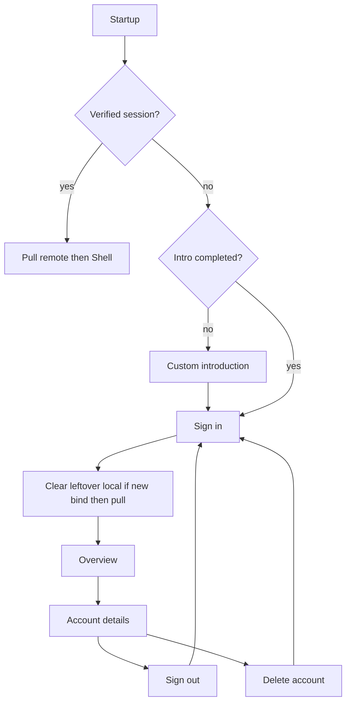

**Superseded.** Do not implement from this file. Split into [Auth gate and intro](auth_gate_intro.plan.md), [Sign-in display name and Terms](auth_signin_name_terms.plan.md), and [Account details and delete](auth_account_details_delete.plan.md).

# Auth wall + intro (no guest mode)

## Why data vanishes today

Guest writes never enter the pending sync queue. On Google/OTP sign-in, [`AuthService.bindAfterVerifiedSignIn`](sprout_app/lib/features/auth/application/auth_service.dart) migrates Hive `userId`s then `flush` + `pullRemote`. Flush is usually empty. If the Google account already has any remote rows, each repo **clears the whole Hive box** and replaces it with cloud data. Sign-out then looks empty because the wipe already happened.

Product change: **do not use the app until signed in.**

## Product rules (locked)

- First launch: custom introduction, then sign-in. Later unsigned launches: sign-in only.
- No guest mode. No creating accounts/goals/transactions until verified.
- After sign-in: pull cloud (empty overview for a new account). **Discard leftover guest Hive** — do not migrate it onto the new uid.
- Same-account re-login: keep local cache, flush pending, pull.
- Different verified account: clear Hive + pending, pull that account.
- Sign-out: session only; return to sign-in. Shell is not reachable while signed out.
- Startup failure: **Retry only** — remove “Continue local-only”.
- Email OTP: optional **display name**. Google: use Google profile name; do not ask again.
- Sign-in requires agreeing to Terms (checkbox or “By continuing you agree…” with a tappable Terms link).
- In-app **delete account** (Play requirement). Wipes this user’s cloud rows (FK cascade), local Hive, then sign-in.

## Introduction: custom widget, not the package

Use a small custom `PageView` (dots + last CTA **Sign in**). [`introduction_screen`](https://pub.dev/packages/introduction_screen) would still need a full dark-theme restyle and an extra dependency; three slides are cheaper as our own widget under [`sprout_app/lib/features/auth/presentation/intro_page.dart`](sprout_app/lib/features/auth/presentation/intro_page.dart). Persist `intro_completed` in settings Hive via [`UserContext`](sprout_app/lib/core/user/user_context.dart).

Suggested slides:

1. Track your savings in one place
2. Set goals and watch them grow
3. Sign in so your data stays with you

## Sign-in

Extract the guest form from [`account_page.dart`](sprout_app/lib/features/auth/presentation/account_page.dart) into `sign_in_page.dart`.

- Email, optional display name, send code, OTP, Google.
- After OTP verify: `auth.updateUser` with `user_metadata.display_name` when the field is non-empty.
- Extend [`AuthUser`](sprout_app/lib/features/auth/domain/auth_user.dart) with `displayName` (Supabase `user_metadata` `display_name` / `full_name` / `name`).
- Footer: Terms hyperlink. Opening it pushes `TermsPage` (not an external website).

**Auth gate** in [`app.dart`](sprout_app/lib/app.dart):

- Signed out + intro not done → intro
- Signed out + intro done → sign-in
- Verified → `ShellPage`

Create `HomeBloc` / `GoalsBloc` only under the signed-in branch.

## Terms of service (Firebase Remote Config)

Not RevenueCat. You already use Firebase Remote Config for flags.

- Bundled fallback markdown in e.g. `sprout_app/assets/legal/terms.md` so first launch / offline still works.
- RC string parameter `terms_of_service` (markdown). When Firebase is ready and fetch succeeds, use the remote string; otherwise the asset.
- Extend [`RemoteConfigService`](sprout_app/lib/core/flags/remote_config_service.dart) with a string getter (today it only has bool flags, and setup is **development-only**). Fetch the terms string whenever Firebase is configured; prod keeps the bundled file until prod Firebase RC is on.
- `TermsPage`: scrollable markdown (`flutter_markdown`). Link from sign-in and from Account details.
- **You:** add `terms_of_service` in the **dev** Firebase Remote Config console (paste markdown). App ships a sensible placeholder until you do.

## Settings tile + Account details

Today the Settings Account row always says “Sign in with email or Google” even when signed in ([`settings_page.dart`](sprout_app/lib/features/settings/presentation/settings_page.dart) ~93–105).

**Settings tile** (listen to `AuthService`):

- Leading: circle avatar with initial from display name or email
- Title: display name, else email, else “Account”
- Subtitle: email when a name is shown, otherwise “Signed in with Google” / “Signed in with email”
- Still opens Account details

**Account details** (replace the current signed-in `AccountPage` list):

- Large avatar + display name + email
- Optional edit display name (saves `user_metadata`)
- Sign out
- Terms of service
- Delete account (destructive, at the bottom)

Keep the page UI-only; logic stays in `AuthCubit` / `AuthService`.

## Delete account

Confirm sheet: short warning that savings data is removed permanently; primary action **Delete account**.

Cannot call Auth Admin from the anon key. Add a migration:

- `private.delete_own_account()` `SECURITY DEFINER` deletes `auth.users` where `id = auth.uid()`
- Thin `public.delete_own_account()` invoker wrapper for `supabase.rpc`
- Existing tables already `references auth.users (id) on delete cascade`

App flow: RPC → clear Hive entity boxes + pending + intro flag stays → `Purchases.logOut()` if configured → sign out → auth gate shows sign-in.

Subscriptions: deletion does not refund or cancel Play billing. Copy should say they can manage/cancel Premium separately if subscribed.

**You:** apply the new migration on the **dev** Supabase project (`supabase db push` or dashboard) if the agent cannot.

## Bind / sync

[`bindAfterVerifiedSignIn`](sprout_app/lib/features/auth/application/auth_service.dart):

- `previousUid == newUid` → set ids, flush, pull
- else → **clear** entity boxes + pending, set ids, **pull only** (no guest migrate)

Remove [`migrateHiveUserIdsToAuthUser`](sprout_app/lib/core/storage/migrate_hive_user_id_to_auth.dart) from bind and [`startup_initializer.dart`](sprout_app/lib/core/startup/startup_initializer.dart).

## Tests / docs

- Auth service: first sign-in clears leftover local then pull; same-uid flush+pull; A→B clear+pull; delete-account clears local; sign-out keeps rows but session gone.
- Cubit: sign-in, optional name, terms navigation, delete confirm.
- Gate/intro: intro flag; skip intro later.
- Sync gate unchanged (unsigned cannot enqueue).
- [`docs/SUPABASE_AUTH_TODOS.md`](docs/SUPABASE_AUTH_TODOS.md) locked rules + human RC terms parameter + delete-account migration.

## Device check (you)

1. Fresh install: intro → sign-in (name optional, open Terms) → Google/OTP → overview.
2. Settings Account tile shows your name/email, not “Sign in…”.
3. Account page: sign out returns to sign-in, not empty overview.
4. Re-login → same cloud data.
5. Delete account → confirm → back on sign-in; old data gone on that Google/email.
