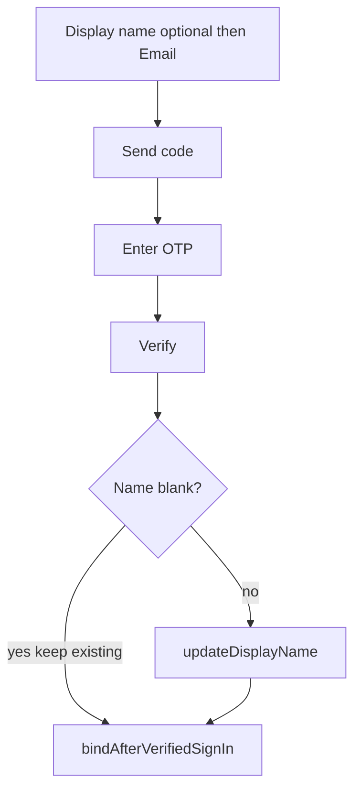

# Auth UI, display name, and delete-account fix

## Sign-in: placeholder icon + name before email

Today [`sign_in_page.dart`](sprout_app/lib/features/auth/presentation/sign_in_page.dart) shows Email → Send code, then (only after OTP is sent) Display name + code. That is why a returning user feels they must type a name again.

Change the email OTP block to:

1. Centered placeholder mark above the fields (large `CircleAvatar` + `Icons.eco_rounded`, or similar). Leave a `TODO` so the real app icon can drop in later — do not wire [`docs/branding/sprout-icon-selected-1024.png`](docs/branding/sprout-icon-selected-1024.png) in this pass.
2. **Display name** field first (always visible, not gated on `otpSent`).
3. **Email**, then **Send code**.
4. After send: only the verification code + Verify.

Keep Google as-is (no name field). Copy: keep [`AppStrings.displayNameOptional`](sprout_app/lib/core/constants/app_strings.dart) and add a short helper under the field, e.g. “Leave blank if you already have an account.”

Logic already skips `updateDisplayName` when the field is blank ([`auth_service.dart`](sprout_app/lib/features/auth/application/auth_service.dart) lines 66–69). Returning users leave it empty and keep the stored name. If they type a name, it still updates after verify.

Update the existing assertions in [`sign_in_page_test.dart`](sprout_app/test/auth/sign_in_page_test.dart) (name is visible before Send code). Cubit tests already cover skip-when-blank.

## Why the dashboard name looks stale (bug, not delay)

`updateUser(UserAttributes(data: {'display_name': ...}))` is the right Auth API. The session user at line 160 is updated immediately — **not a replication delay**.

Two reasons the **Authentication → Users** list can still show the old name:

- GoTrue **merges** `user_metadata`. Google (and some email identities) already have `full_name` / `name`. The Studio “Display name” column typically prefers `full_name` / `name`, **not** `display_name`.
- The app reads `display_name` first ([`displayNameFromMetadata`](sprout_app/lib/features/auth/domain/auth_user.dart)), so the app looks correct while the dashboard does not.

Fix in [`auth_repository_impl.dart`](sprout_app/lib/features/auth/data/auth_repository_impl.dart): write the same trimmed string to `display_name` **and** `full_name` so the dashboard and the app stay aligned. Edit-name on Account uses the same method, so it is covered too.

## Delete account: root cause + graceful error

Confirmed on the linked project (`uprntgokadmkrjrklsyr`):

- [`public.delete_own_account()`](supabase/migrations/20260819120000_delete_own_account.sql) is **SECURITY INVOKER** and runs `select private.delete_own_account()`.
- `authenticated` has **EXECUTE** on both functions but **no USAGE** on schema `private`.
- Postgres then raises `42501 permission denied for schema private` — the exact `PostgrestException` on the Account page.

Do **not** grant USAGE on `private`. Add a follow-up migration that:

- Recreates `public.delete_own_account()` as **SECURITY DEFINER** (`set search_path = ''`) so the wrapper can call into `private` without exposing the schema.
- Revokes EXECUTE on `private.delete_own_account` from `authenticated` / `anon` / `public` (only the public wrapper stays callable).
- Keeps `auth.uid()` checks inside the private definer function.

Apply that SQL via the linked Supabase MCP during implementation, and keep the file under [`supabase/migrations/`](supabase/migrations/) so prod can get the same change later. Update the delete-RPC note in [`docs/SUPABASE_AUTH_TODOS.md`](docs/SUPABASE_AUTH_TODOS.md).

**UI:** [`deleteOwnAccount`](sprout_app/lib/features/auth/data/auth_repository_impl.dart) currently maps unknown errors with `e.toString()`, so PostgREST dumps into the page. Catch `PostgrestException` (and keep a generic fallback) and throw `AuthAppException(AppStrings.deleteAccountFailed)` — e.g. “Could not delete your account. Try again.”

## Account page sections

Rebuild the signed-in list in [`account_page.dart`](sprout_app/lib/features/auth/presentation/account_page.dart) into grouped cards (same idea as transaction detail’s `_SectionCard`, kept private to this page):

- Header: avatar, name, email (and a compact error banner if present — friendly copy, not raw exceptions).
- **Profile:** Edit display name.
- **Session:** Sign out + the existing “keeps local data” caption as subtitle, not a stray paragraph.
- **Legal:** Terms, Privacy (chevrons).
- **Danger zone:** Delete account in error color.

Add section titles to `AppStrings`. No new `testWidgets` unless an existing account test breaks.

## Verify

- `cd sprout_app && flutter analyze && flutter test` (report hangs; do not loop).
- Device: sign-in layout (icon, name then email); returning user can skip name; edit name then refresh the Users row in Studio; delete account succeeds (or shows the friendly message if anything else fails).

**Human later:** apply the new delete migration on **prod** when you do the prod auth pass. The agent will apply it on the linked (dev) project.
