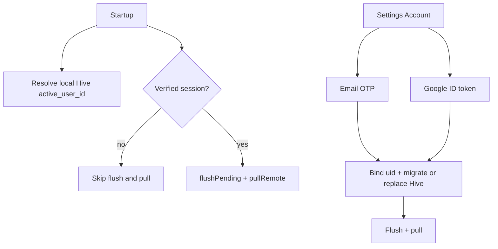

# Auth UI / app implementation

Aligns with [docs/SUPABASE_AUTH_TODOS.md](../../docs/SUPABASE_AUTH_TODOS.md): local-only until verified sign-in, email OTP (no deep links), Google on Android, no Apple/iOS.

## Product behavior (locked)

- Guests use the full app on **Hive only** (local `active_user_id`).
- Sync/enqueue/flush/pull run only with a **verified** Supabase session (`currentUser != null && !isAnonymous`).
- Remove `signInAnonymously()` from startup.
- Settings → Account: sign in (OTP + Google) or signed-in status + sign out.
- Sign-out: clear session; **keep** local Hive data (guest continues with last local uid).
- Sign-in bind rules:
  - **Guest local uuid → new verified uid:** rewrite local `userId`s via [`migrate_hive_user_id_to_auth.dart`](../../sprout_app/lib/core/storage/migrate_hive_user_id_to_auth.dart), then flush + pull.
  - **Already verified A → sign in as B:** clear entity boxes + pending queue, set uid to B, pull remote.
  - **Same uid re-login:** flush + pull only.



## Feature layout

New feature under [`sprout_app/lib/features/auth/`](../../sprout_app/lib/features/auth/) per [clean-architecture](../rules/clean-architecture.mdc):

| Layer | Contents |
|-------|----------|
| `domain/` | `AuthUser` (id, email?, isAnonymous), `AuthRepository` interface |
| `data/` | `AuthRepositoryImpl` wrapping `SupabaseClient` + `GoogleSignIn` |
| `application/` | `AuthService` (sendOtp, verifyOtp, signInWithGoogle, signOut, sync gate, post-sign-in bind) |
| `presentation/` | `AuthCubit`/`AuthBloc`, `account_page.dart` (signed-in vs guest), OTP step UI |
| `export.dart` | Barrel |

Pages stay UI-only; validation/errors via existing `AuthAppException` / `AuthFailure` in [`app_exception.dart`](../../sprout_app/lib/core/error/app_exception.dart) / [`failure.dart`](../../sprout_app/lib/core/error/failure.dart).

## UI

1. [`settings_page.dart`](../../sprout_app/lib/features/settings/presentation/settings_page.dart) — top `ListTile` “Account” → `AccountPage`.
2. **`AccountPage`**
   - Guest: email field → Send code; OTP field → Verify; “Continue with Google”.
   - Signed in: email/provider summary + Sign out.
   - When Supabase not configured: disable OTP/Google; short local-only message.
3. Page-scoped `BlocProvider` (same pattern as transactions). No app-wide login wall.

## Config

Extend flavor JSON + `AppConfig`:

```json
{
  "supabaseUrl": "...",
  "supabaseAnonKey": "...",
  "googleWebClientId": "....apps.googleusercontent.com"
}
```

- Required for Google when Supabase is configured; empty → hide/disable Google button.
- Document in [`docs/SUPABASE_AUTH_TODOS.md`](../../docs/SUPABASE_AUTH_TODOS.md) and [`supabase/README.md`](../../supabase/README.md).
- Dependency: `google_sign_in` (Android). No Apple / deep-link packages in this phase.

## Startup + sync gating

**[`startup_initializer.dart`](../../sprout_app/lib/core/startup/startup_initializer.dart)**

- Initialize Supabase if configured; **do not** `signInAnonymously()`.
- Update [`user_context.dart`](../../sprout_app/lib/core/user/user_context.dart): ignore anonymous sessions; prefer verified `auth.uid`, else local Hive id.
- Call `flushPending` / `pullRemote` only when sync allowed.

**[`sync_service.dart`](../../sprout_app/lib/features/sync/application/sync_service.dart)** + enqueue in [`service_locator.dart`](../../sprout_app/lib/core/di/service_locator.dart) / repos:

- Central `AuthService.canSync` (or small `SyncGate`) used by:
  - `SyncService.flushPending`
  - `pendingQueue.onEnqueued`
  - `ConnectivityCubit` flush
  - repo enqueue (do not queue when guest)
  - `pullRemote` at startup and manual pulls

## Post sign-in bind (`AuthService`)

1. Read previous local uid from settings box.
2. Apply migrate / clear / no-op per rules above.
3. Set `active_user_id` to verified uid; flush + pull.
4. Sign-out: `supabase.auth.signOut()`; leave Hive / `active_user_id` unchanged.

## DI

Register in [`service_locator.dart`](../../sprout_app/lib/core/di/service_locator.dart): `AuthRepository`, `AuthService`, `GoogleSignIn` with `serverClientId: googleWebClientId`.

## Tests

- Sync gate: no flush/enqueue without verified session.
- Auth repository/service with mocks (prefer existing `mocks.dart`).
- Bloc: OTP send → verify state transitions.

## Docs touch-up

- Update app follow-ups in [`docs/SUPABASE_AUTH_TODOS.md`](../../docs/SUPABASE_AUTH_TODOS.md) as items land.
- Add `googleWebClientId` to config examples in supabase README.

## Out of scope

Magic link, deep links, Apple, iOS, email/password, 2FA, forcing login before using the app.

## Human prereqs (not agent)

Dashboard items in SUPABASE_AUTH_TODOS (Email OTP template, Google provider, Anonymous off, Google Cloud clients + SHA-1s). App work can land first; Google/OTP fail until those are filled.
