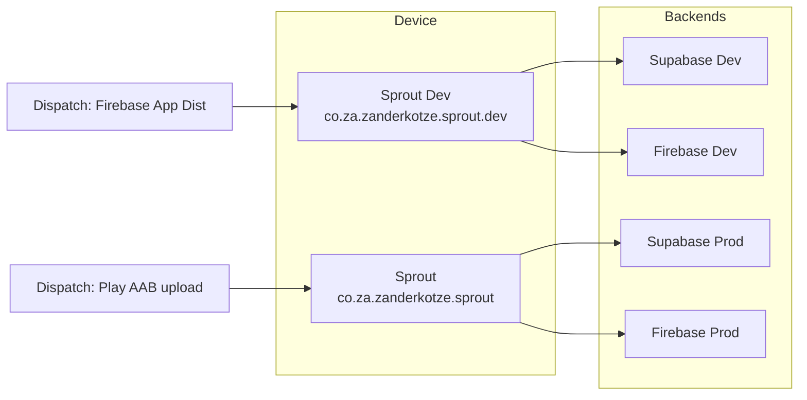

# Develop + Production Profiles (side-by-side, Play for prod)

## Current state

- Dart already has env profiles: [`main_development.dart`](sprout_app/lib/main_development.dart) / [`main_production.dart`](sprout_app/lib/main_production.dart) → gitignored JSON configs with Supabase URL/key.
- Android is **single package** `co.za.zanderkotze.sprout.dev` in [`build.gradle.kts`](sprout_app/android/app/build.gradle.kts) — no flavors.
- CI has dispatch-only [Firebase Distribute (Dev Android APK)](.github/workflows/firebase-distribute-dev-android.yml); no production Play workflow.
- Docs already mention unused `APP_CONFIG_PROD_BASE64`.

## Target architecture



| Profile | applicationId | Entry | Config | Firebase | Supabase | Distribution |
|---------|---------------|-------|--------|----------|----------|--------------|
| development | `…sprout.dev` | `main_development.dart` | `development.json` | Dev project/app | Dev project | Firebase App Distribution |
| production | `…sprout` | `main_production.dart` | `production.json` | Prod project/app | Prod project | Google Play (AAB) |

---

## 1. Code: Android product flavors

Update [`sprout_app/android/app/build.gradle.kts`](sprout_app/android/app/build.gradle.kts):

- Set shared `namespace` / base `applicationId` to `"co.za.zanderkotze.sprout"` (quoted, Flutter-parseable).
- Add `flavorDimensions += "environment"` and flavors:
  - `development` → `applicationIdSuffix = ".dev"`, `resValue("string", "app_name", "Sprout Dev")`
  - `production` → no suffix, `resValue("string", "app_name", "Sprout")`
- Remove the `ANDROID_APPLICATION_ID` / `-PandroidApplicationId` override path (flavors replace it).
- Keep existing release signing via `key.properties`.

Move Kotlin entry:

- [`MainActivity.kt`](sprout_app/android/app/src/main/kotlin/co/za/zanderkotze/sprout/dev/MainActivity.kt) → `…/kotlin/co/za/zanderkotze/sprout/MainActivity.kt` with `package co.za.zanderkotze.sprout`.

Manifest / resources:

- [`AndroidManifest.xml`](sprout_app/android/app/src/main/AndroidManifest.xml): `android:label="@string/app_name"`.
- Flavor `google-services.json` paths (gitignored; CI writes them):
  - `android/app/src/development/google-services.json`
  - `android/app/src/production/google-services.json`

Wire flavors into IDE launches in [`.vscode/launch.json`](.vscode/launch.json): add `"args": ["--flavor", "development"]` / `"production"` to match each entrypoint.

Local run commands become:

```bash
flutter run --flavor development -t lib/main_development.dart
flutter run --flavor production -t lib/main_production.dart
```

No Dart flavor code changes beyond launch args — config loading already works.

---

## 2. Supabase (manual console work + config)

**Create two projects** (if you only have one today, keep it as **development** and create a second for **production**).

For **each** project:

1. Run all SQL under [`supabase/migrations/`](supabase/migrations/) (SQL editor or CLI linked to that project).
2. Auth → Providers → enable **Anonymous** (app calls `signInAnonymously()` when configured).
3. Settings → API: copy **Project URL** + **anon/publishable** key.

Write local (gitignored) configs:

- `sprout_app/assets/config/development.json` → Dev project URL/key
- `sprout_app/assets/config/production.json` → Prod project URL/key

Encode for GitHub secrets (same pattern as today):

```bash
base64 -i sprout_app/assets/config/development.json | tr -d '\n'  # APP_CONFIG_DEV_BASE64
base64 -i sprout_app/assets/config/production.json | tr -d '\n'   # APP_CONFIG_PROD_BASE64
```

Update [`supabase/README.md`](supabase/README.md) to document two-project setup (dev vs prod) and that schemas must stay in sync by applying the same migrations to both.

---

## 3. Firebase (manual console work)

**Development** (already partly done — `sprout-app-development`):

- Android app package: `co.za.zanderkotze.sprout.dev`
- Download `google-services.json` → place under `src/development/`
- Keep App Distribution groups + service account for the **dev** workflow
- Secrets: `GOOGLE_SERVICES_DEV_BASE64`, `FIREBASE_APP_ID`, `FIREBASE_SERVICE_ACCOUNT_JSON` (existing)

**Production** (new):

- Create a **separate Firebase project** (or at least a separate Android app) registered as `co.za.zanderkotze.sprout`
- Enable Analytics / Crashlytics to match Gradle plugins
- Download prod `google-services.json` → `src/production/` locally; encode as `GOOGLE_SERVICES_PROD_BASE64` for CI
- **No** App Distribution for prod

Play Console will need the same release signing certificate SHA-1 registered on the prod Firebase Android app if you use Google services that require it later.

---

## 4. Google Play (manual console work)

1. Create Play Console app with package `co.za.zanderkotze.sprout`.
2. Create a Play Console API service account with access to that app; store JSON as `PLAY_STORE_SERVICE_ACCOUNT_JSON`.
3. Upload at least one manual AAB once (or use internal testing track) so API uploads are allowed — Play often requires an initial manual artifact / completed listing basics.
4. Confirm release keystore in `ANDROID_SIGNING_CONFIG_BASE64` is the **upload key** registered with Play App Signing.

---

## 5. CI workflows

### Update existing dev distribute workflow

[`.github/workflows/firebase-distribute-dev-android.yml`](.github/workflows/firebase-distribute-dev-android.yml):

- Write `google-services.json` to `android/app/src/development/google-services.json` (not `android/app/`).
- Build: `flutter build apk --release --flavor development -t lib/main_development.dart --no-tree-shake-icons`
- Artifact path becomes flavor-aware, e.g. `…/flutter-apk/app-development-release.apk`
- Drop `ANDROID_APPLICATION_ID` usage

### Add production Play workflow (dispatch only)

New [`.github/workflows/play-publish-prod-android.yml`](.github/workflows/play-publish-prod-android.yml):

- `on: workflow_dispatch` with inputs: `git_ref`, `track` (default `internal`), optional `release_notes` / status
- Secrets: `APP_CONFIG_PROD_BASE64`, `GOOGLE_SERVICES_PROD_BASE64`, `ANDROID_SIGNING_CONFIG_BASE64` (required for Play), `PLAY_STORE_SERVICE_ACCOUNT_JSON`
- Build: `flutter build appbundle --release --flavor production -t lib/main_production.dart --no-tree-shake-icons`
- Upload AAB with `r0adkll/upload-google-play` (or equivalent) to `co.za.zanderkotze.sprout`, track from input
- Expected bundle path: `sprout_app/build/app/outputs/bundle/productionRelease/app-production-release.aab`

### Docs

- Refresh [`docs/FIREBASE_DEV_DISTRIBUTION.md`](docs/FIREBASE_DEV_DISTRIBUTION.md) (fix stale `com.example.sprout`, flavor paths, APK name).
- Add a short Play publish doc (or section) listing prod secrets and dispatch inputs.
- Touch [`README.md`](README.md) run commands to include `--flavor`.

---

## 6. Secrets checklist (GitHub)

| Secret | Used by |
|--------|---------|
| `APP_CONFIG_DEV_BASE64` | Dev distribute |
| `APP_CONFIG_PROD_BASE64` | Prod Play |
| `GOOGLE_SERVICES_DEV_BASE64` | Dev distribute |
| `GOOGLE_SERVICES_PROD_BASE64` | Prod Play |
| `ANDROID_SIGNING_CONFIG_BASE64` | Both (required for Play) |
| `FIREBASE_APP_ID` | Dev distribute only |
| `FIREBASE_SERVICE_ACCOUNT_JSON` | Dev distribute only |
| `PLAY_STORE_SERVICE_ACCOUNT_JSON` | Prod Play only |

Remove reliance on `ANDROID_APPLICATION_ID` once flavors land.

---

## Out of scope

- iOS schemes / App Store
- Dart `Firebase.initializeApp` / FlutterFire (`firebase_options.dart`) — native Gradle plugins only, as today
- Automating Supabase migration apply from CI
- Changing Supabase schema between envs
