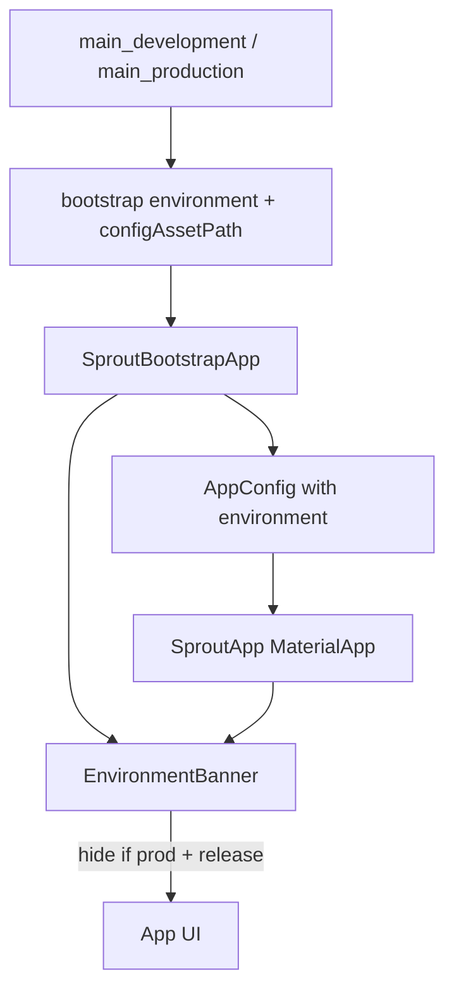

# Environment Banner Component

## Visibility rule

Show the banner in every build **except** production + release:

| | Debug / Profile | Release |
|---|---|---|
| Development | DEV banner | DEV banner |
| Production | PROD banner | hidden |

Use `kReleaseMode` from `foundation.dart` plus an explicit `AppEnvironment` (not the config asset path string).

## Approach

### 1. Add `AppEnvironment` and wire it through startup

New enum in [`sprout_app/lib/core/config/app_environment.dart`](sprout_app/lib/core/config/app_environment.dart):

```dart
enum AppEnvironment { development, production }
```

Extend [`AppConfig`](sprout_app/lib/core/config/app_config.dart) with `final AppEnvironment environment`, and pass it into `load` / `tryLoad` / `_loadConfigJson` so the singleton registered in DI always knows the profile.

Thread it from entrypoints (no path sniffing):

- [`main.dart`](sprout_app/lib/main.dart) / [`main_development.dart`](sprout_app/lib/main_development.dart) → `AppEnvironment.development`
- [`main_production.dart`](sprout_app/lib/main_production.dart) → `AppEnvironment.production`

Update the chain: `bootstrap` → `SproutBootstrapApp` → `initializeApp` → `AppConfig.load(..., environment: ...)`.

Export the enum from [`core.dart`](sprout_app/lib/core/core.dart) if other core exports live there.

### 2. Reusable `EnvironmentBanner` UI component

Add [`sprout_app/lib/ui/widgets/environment_banner.dart`](sprout_app/lib/ui/widgets/environment_banner.dart) and export it from [`ui/export.dart`](sprout_app/lib/ui/export.dart).

API:

```dart
class EnvironmentBanner extends StatelessWidget {
  const EnvironmentBanner({
    super.key,
    required this.environment,
    required this.child,
  });

  final AppEnvironment environment;
  final Widget child;
  // ...
}
```

Behavior:

- If `environment == production && kReleaseMode` → return `child` unchanged.
- Otherwise wrap with Flutter’s built-in `Banner` (diagonal corner ribbon — same idea as the DEBUG banner, does not push content down / conflict with the offline strip).
- Labels: `DEV` / `PROD`.
- Colors (new tokens on [`AppColors`](sprout_app/lib/core/constants/app_colors.dart)):
  - `environmentDev` — amber (`0xFFF59E0B`)
  - `environmentProd` — coral (`accentCoral` / `0xFFFF6B6B`) so a non-release prod run is visually distinct and cautionary

Keep the widget self-contained so it can wrap any subtree (tests, startup, main app).

### 3. Mount at app roots via `MaterialApp.builder`

In [`app.dart`](sprout_app/lib/app.dart), read `sl<AppConfig>().environment` and set:

```dart
builder: (context, child) => EnvironmentBanner(
  environment: sl<AppConfig>().environment,
  child: child ?? const SizedBox.shrink(),
),
```

Also wrap the startup `MaterialApp` in [`startup_flow.dart`](sprout_app/lib/features/startup/startup_flow.dart) the same way (pass `environment` into `SproutBootstrapApp` so it is available before DI is ready).



## Out of scope

- Android product flavors / applicationId (separate plan)
- Changing `debugShowCheckedModeBanner` behavior beyond keeping it `false`
- iOS-specific UI
