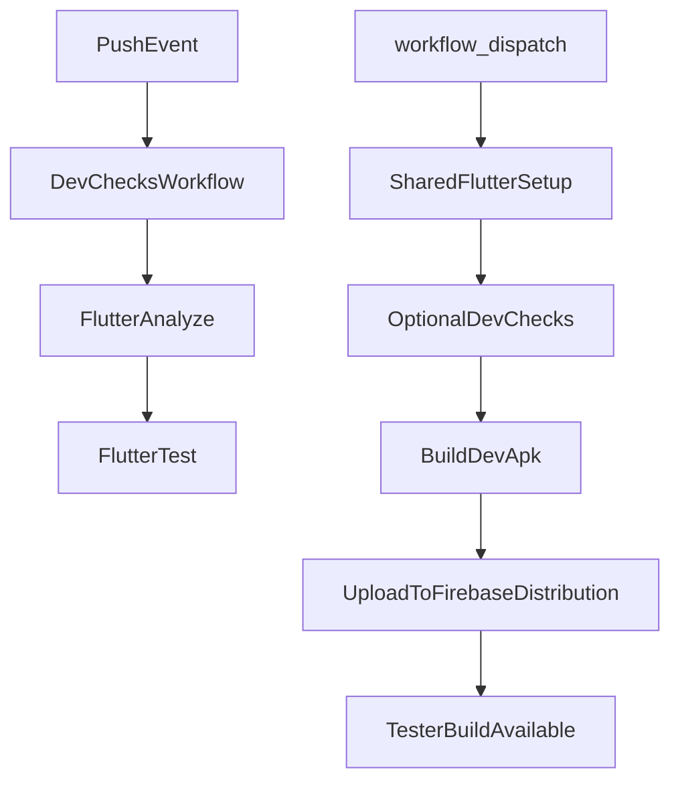

# Dev CI And Firebase APK Plan

## Goal
Create a GitHub Actions setup with:
- a push-based development validation workflow that runs linting and tests for [sprout_app](sprout_app), and
- a manually triggered Firebase App Distribution workflow that builds a development Android `apk` from [sprout_app/lib/main_development.dart](sprout_app/lib/main_development.dart) and uploads it for tester access.

This plan explicitly keeps Firebase distribution for active development separate from future production Play Store delivery.

## Current Repo Constraints
- There is no existing CI/CD config in this repo yet.
- Android release builds are not production-ready because [sprout_app/android/app/build.gradle.kts](sprout_app/android/app/build.gradle.kts) still signs `release` with the debug key.
- The Android app id is still the placeholder `com.example.sprout` in [sprout_app/android/app/build.gradle.kts](sprout_app/android/app/build.gradle.kts), which should be replaced before wiring Firebase distribution.
- The app already has the right entrypoint split for this model via [sprout_app/lib/main_development.dart](sprout_app/lib/main_development.dart), [sprout_app/lib/main_production.dart](sprout_app/lib/main_production.dart), and [.vscode/launch.json](.vscode/launch.json), plus config assets declared in [sprout_app/pubspec.yaml](sprout_app/pubspec.yaml).
- The repo appears to be Android-only right now; there is no checked-in `ios/` project, so iOS distribution is out of scope for this first pass.

## Recommended Approach
Use GitHub Actions with reusable workflows or composite actions plus Firebase CLI upload. This is the best fit because:
- it gives you one push-based quality gate for daily development,
- it keeps the manual Firebase delivery path separate and easy to trigger,
- it favors reusable CI building blocks for future expansion into production/Play Store automation,
- it requires no Firebase SDK integration inside the app itself.

## Implementation Steps
1. Establish reusable CI foundations.
- Create shared GitHub Actions pieces for common setup:
`checkout`, Java setup, Flutter setup, dependency restore, and working directory conventions for `sprout_app`.
- Prefer reusable workflows in `.github/workflows/` for larger jobs and composite actions under `.github/actions/` for repeated setup steps.
- Keep workflow inputs generic enough that a later production pipeline can reuse the same Flutter setup/build scaffolding.

2. Add the push validation workflow.
- Create a workflow such as `.github/workflows/ci-dev-checks.yml`.
- Trigger it on every push.
- Run at minimum:
  - `flutter pub get`
  - `flutter analyze`
  - `flutter test`
- Point the workflow at the `sprout_app` directory and keep it focused on fast developer feedback.
- Optionally expose this as a reusable workflow so future PR, tag, or release workflows can call the same validation logic.

3. Prepare Android for Firebase dev builds.
- Update [sprout_app/android/app/build.gradle.kts](sprout_app/android/app/build.gradle.kts) to use a proper release signing config loaded from `key.properties` or environment variables.
- Replace the placeholder `applicationId`/`namespace` with your real package id.
- Standardize on `apk` for Firebase tester builds.
- Keep production-specific concerns out of this workflow; the dev distribution pipeline should build from the development entrypoint only.

4. Create Firebase App Distribution prerequisites for development.
- Create or confirm a Firebase project and register the Android development app using the final package id.
- Capture the Firebase App Distribution app id for Android.
- Decide tester targeting: tester emails, groups, or both.
- Generate CI credentials for upload. Preferred option: a Firebase service account JSON stored as a GitHub secret.

5. Define GitHub Actions secrets and variables.
- Add secrets for Android signing material:
`ANDROID_KEYSTORE_BASE64`, `ANDROID_KEY_ALIAS`, `ANDROID_KEY_PASSWORD`, `ANDROID_STORE_PASSWORD`.
- Add secrets for Firebase auth, either:
`FIREBASE_SERVICE_ACCOUNT_JSON` or a Firebase token if you prefer CLI token auth.
- Add repo variables or workflow inputs for:
`FIREBASE_APP_ID`, tester groups, and release notes text.
- If dev builds need backend connectivity in CI, inject the existing runtime overrides documented in [supabase/README.md](supabase/README.md): `SUPABASE_URL` and `SUPABASE_ANON_KEY`.

6. Add the manual Firebase distribution workflow.
- Create a workflow such as `.github/workflows/firebase-distribute-dev-android.yml`.
- Use `workflow_dispatch` inputs such as:
  - `release_notes`
  - `tester_groups`
  - optional `git_ref` if you want to build a branch manually
- Steps should:
  - call the shared setup/action pieces created earlier
  - optionally invoke the shared validation workflow first, or repeat `flutter analyze` and `flutter test` before build if you want strict gating on manual distribution
  - reconstruct the keystore and `key.properties`
  - run `flutter build apk --release -t lib/main_development.dart` from `sprout_app`
  - upload the generated artifact with Firebase CLI to App Distribution

7. Add minimal CI/release documentation.
- Document the required secrets, package id, Firebase app id, and the exact manual trigger flow in a small repo doc or existing setup doc.
- Document the split clearly:
development entrypoint plus Firebase for internal testing now, production entrypoint plus Play Store later.
- Include the expected artifact path and how release notes/tester groups are supplied.

## Suggested Workflow Shape

## Reuse Strategy
- Put one reusable workflow around app validation so later PR and release workflows can call it.
- Put repeated setup logic in a composite action if the same Flutter/Java/bootstrap steps appear in more than one workflow.
- Keep build-target-specific logic thin so a later Play Store production workflow can swap only the entrypoint, signing, and distribution/upload step.

## Repo Files Most Likely To Change
- [sprout_app/android/app/build.gradle.kts](sprout_app/android/app/build.gradle.kts)
- [.github/workflows/ci-dev-checks.yml](.github/workflows/ci-dev-checks.yml)
- [.github/workflows/firebase-distribute-dev-android.yml](.github/workflows/firebase-distribute-dev-android.yml)
- [.github/workflows/](.github/workflows/) reusable workflow files for shared Flutter checks/setup
- [.github/actions/](.github/actions/) if you choose composite actions for shared setup
- [supabase/README.md](supabase/README.md) or a new CI/release setup doc

## Important Decisions Already Locked
- Firebase distribution artifact should be an `apk`
- Firebase distribution should use the development entrypoint, not production
- Production release automation should be deferred and kept conceptually separate for later Play Store work
- A push-based workflow should lint and verify tests on every push

## Remaining Important Decisions
- Final Android package id for the dev-distributed app
- Firebase auth method in CI: service account JSON preferred
  - `release_notes`
- Whether manual Firebase distribution should always run validation first or allow a faster build-only path
- Whether release notes come from a workflow input, commit messages, or a file

## Recommended First Pass
Implement:
- one reusable dev-checks workflow that runs `flutter analyze` and `flutter test` on every push, and
- one manual GitHub Actions workflow that builds a signed development `apk` from `lib/main_development.dart` and distributes it to one Firebase tester group.

That gives you immediate developer feedback plus an internal tester delivery path, while keeping the design extensible for later production Play Store automation.