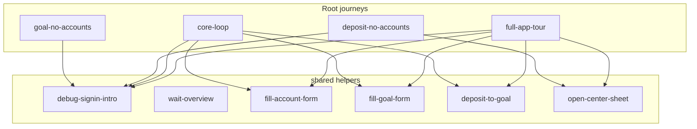
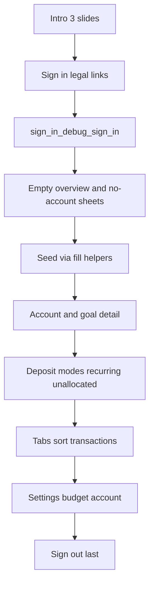

# Full-app Maestro journey (composable subflows)

Replace [`.maestro/full-app-tour.yaml`](.maestro/full-app-tour.yaml) with an orchestrator that walks **every reachable page, sheet, and button**. Extract shared steps so later journeys do not copy-paste launch, auth, or form-fill.

App id stays `app.stackmint.sprout.dev`. Taps use `SemanticsIds` only; `text:` is for dropdown menu items and assertions ([`.cursor/rules/maestro.mdc`](.cursor/rules/maestro.mdc)).

## Layout

Maestro’s default discovery is **root `.maestro/*.yaml` only** — nested folders are ignored. Helpers therefore live in a subfolder and are never run as standalone tests.

```
.maestro/
  config.yaml                 # appId + flows: ["*"]  (root journeys only)
  core-loop.yaml
  deposit-no-accounts.yaml
  goal-no-accounts.yaml
  full-app-tour.yaml          # orchestrator
  shared/                     # runFlow helpers — no launchApp
    debug-signin-intro.yaml
    wait-overview.yaml
    fill-account-form.yaml
    fill-goal-form.yaml
    deposit-to-goal.yaml
    open-center-sheet.yaml
```

[`config.yaml`](.maestro/config.yaml) locks that convention (`flows: ["*"]`) so a future `**` glob cannot accidentally execute helpers.



## Helper contract

Each helper is a command-only YAML (optional `env` defaults, **no** `launchApp`). A comment at the top states the required starting screen. Parents pass `env` and decide what happens after save.

| Helper | Assumes | Env | Does |
|--------|---------|-----|------|
| `debug-signin-intro.yaml` | Intro showing Debug sign in | — | wait `intro_debug_sign_in`, tap, then `wait-overview` |
| `wait-overview.yaml` | Signed in | — | wait `Portfolio total` |
| `fill-account-form.yaml` | Account form already open | `ACCOUNT_NAME`, optional `COLOR_INDEX` (default `2`) | name field, `color_swatch_${COLOR_INDEX}`, `form_save` |
| `fill-goal-form.yaml` | Goal form already open, accounts exist | `GOAL_NAME`, `TARGET`, optional `ALREADY_SAVED`, `ACCOUNT_NAME` | name / target / optional already-saved + account dropdown, `form_save` |
| `deposit-to-goal.yaml` | Deposit sheet open, account + goal exist | `ACCOUNT_NAME`, `GOAL_NAME`, `AMOUNT` | account + goal dropdowns, amount, `deposit_save` |
| `open-center-sheet.yaml` | Shell visible | — | `shell_add`, wait “What would you like to do?” |

**Open-from IDs stay in the parent** (`overview_empty_new_account`, `shell_action_new_goal`, etc.). Helpers never own navigation, so the same fill step works from Overview, the FAB, or a no-accounts CTA.

Example parent usage:

```yaml
- tapOn:
    id: "overview_empty_new_account"
- runFlow:
    file: shared/fill-account-form.yaml
    env:
      ACCOUNT_NAME: "Everyday"
      COLOR_INDEX: "2"
- runFlow: shared/wait-overview.yaml
```

Do **not** extract one-off full-tour steps (intro slides, budget tabs, sign-out) until a second journey needs them. Inline `runFlow` + `label` is enough for grouping inside the tour.

## Refactor existing journeys

Today all four YAMLs duplicate launch + debug sign-in + wait Overview; `core-loop` and the draft tour also duplicate account/goal/deposit fill.

- [`core-loop.yaml`](.maestro/core-loop.yaml) — `launchApp` → `debug-signin-intro` → open empty-account → `fill-account-form` → open new-goal → `fill-goal-form` → open deposit → `deposit-to-goal` → assert goal progress.
- [`deposit-no-accounts.yaml`](.maestro/deposit-no-accounts.yaml) — sign-in → `open-center-sheet` → `shell_action_deposit` → assert CTA (unchanged assertions).
- [`goal-no-accounts.yaml`](.maestro/goal-no-accounts.yaml) — sign-in → `overview_empty_new_goal` → assert CTA.

`launchApp` (`clearState` + `clearKeychain`) stays in each **root** journey only.

## Prerequisite: wire tap targets

A few IDs exist in [`semantics_ids.dart`](sprout_app/lib/core/constants/semantics_ids.dart) but are not on the widget. Add only what journeys must tap:

- Account/goal detail history rows → `account_detail_transaction_row` / `goal_detail_transaction_row`
- Goal edit sheet → `goal_name_field` + `goal_target_field` ([`goal_form_sheet.dart`](sprout_app/lib/features/goals/presentation/goal_form_sheet.dart))
- Create-goal “already saved” account → `SproutDropdownField` + new `goal_already_saved_account`
- Edit display name / transaction note fields → new field IDs
- Budget delete dialogs → `SproutDialogActions` (`dialog_cancel` / `dialog_delete`)

`budget_sort_cancel` stays unused (sort modal is Done-only).

## Full-tour orchestrator

[`full-app-tour.yaml`](.maestro/full-app-tour.yaml) is the long journey. It `launchApp`s, then `runFlow`s helpers for seed data and unique steps for coverage. Screenshots only at a few milestones (empty overview, populated overview, settings).



### 1. Auth (no real OTP / Google)

Tour-only (do not reuse `debug-signin-intro` here — that would skip intro/sign-in):

- Tap `intro_next` through all 3 slides → Sign in.
- Open `sign_in_terms_link` and `sign_in_privacy_link`, `back` each time.
- Focus display-name and email fields (do **not** send OTP).
- Tap `sign_in_debug_sign_in`, then `wait-overview`.

### 2. Empty states first

- Assert empty overview guidance.
- `overview_empty_new_goal` → no-accounts CTA → `goal_no_accounts_cancel`.
- `open-center-sheet` → `shell_action_deposit` → assert no-accounts CTA, dismiss (do not create the first account here).
- `overview_empty_new_account` → `fill-account-form` (`Everyday`).
- Goals tab still empty: assert empty guidance.

### 3. Seed via helpers

- Second account: open form from Overview or FAB → `fill-account-form` (`Spare`) — deleted later.
- `fill-goal-form` for **Everyday** (target + already-saved + account dropdown) and **Spare**.
- `deposit-to-goal` Everyday → Everyday (immediate).
- Tour-only deposit steps: to-account (unallocated), future-dated recurring (unlocks clear-scheduled + Recurring page).

### 4–6. Populated surfaces, settings, sign-out

Unchanged from the previous plan: walk every populated button; confirm-delete **Spare** account/goal only; cancel account wipe; `account_sign_out` last. Premium tile is `optional: true` + `back`.

## Out of scope

- Startup error / startup checklist.
- Real email OTP and Google OAuth.
- Completing a RevenueCat purchase.
- Orphaned [`add_group_sheet.dart`](sprout_app/lib/features/budget/presentation/widgets/add_group_sheet.dart).
- Confirming **Delete account**.

## Docs

- README: `shared/` vs root journeys; `maestro test .maestro/` still runs only root files; list helpers as “not runnable alone”.
- [`.cursor/rules/maestro.mdc`](.cursor/rules/maestro.mdc): new reusable steps go in `.maestro/shared/` and are called with `runFlow` + `env`; do not duplicate debug sign-in or form-fill in a new root journey.

## Verify

Run via Maestro MCP: `full-app-tour.yaml`, then the three short journeys (they must still pass after the refactor). Report flakes; do not loop on Flutter widget tests.
