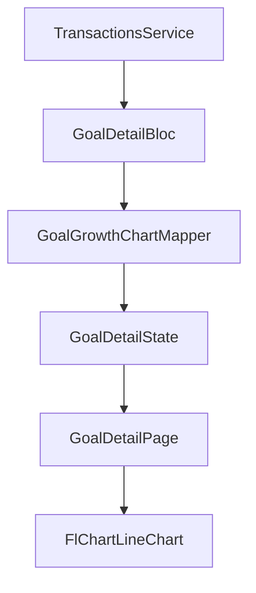

## Scope recap
- **Domain**: Add `TransactionFrequency` enum and new recurring-related fields to `Transaction`.
- **Data**: Persist and map these fields through **Hive** and **Supabase** (including the pending-sync payload path).
- **UI**:
  - Deposit bottom sheet: toggle + frequency dropdown (Daily/Weekly/Monthly)
  - Goal detail: add a growth line chart that starts at goal creation date and Y=0; one point per transaction; tooltip shows date + deposit amount.
- **Architecture**: The transformation from `List<Transaction>` → cumulative chart points must live in **BLoC or a presentation mapper**, not in UI.

## Key existing files (current state)
- Transaction domain model: [`sprout_app/lib/features/transactions/domain/transaction.dart`](sprout_app/lib/features/transactions/domain/transaction.dart)
- Transaction mappers: [`sprout_app/lib/features/transactions/data/transaction_mapper.dart`](sprout_app/lib/features/transactions/data/transaction_mapper.dart)
- Hive model: [`sprout_app/lib/features/transactions/data/local/transaction_hive_model.dart`](sprout_app/lib/features/transactions/data/local/transaction_hive_model.dart)
- Hive adapter (binary layout): [`sprout_app/lib/core/storage/hive_adapters.dart`](sprout_app/lib/core/storage/hive_adapters.dart)
- Pending sync payload encoding/decoding: [`sprout_app/lib/features/transactions/data/pending_sync_payload.dart`](sprout_app/lib/features/transactions/data/pending_sync_payload.dart)
- Goal detail UI (currently stateful, service-driven): [`sprout_app/lib/features/goals/presentation/goal_detail_page.dart`](sprout_app/lib/features/goals/presentation/goal_detail_page.dart)
- Deposit bottom sheet: [`sprout_app/lib/features/shell/presentation/deposit_bottom_sheet.dart`](sprout_app/lib/features/shell/presentation/deposit_bottom_sheet.dart)
- Supabase schema migration: [`supabase/migrations/20260412120000_init.sql`](supabase/migrations/20260412120000_init.sql)

## Design decisions
- **Supabase representation**:
  - Add columns to `public.transactions`:
    - `is_recurring boolean not null default false`
    - `frequency text not null default 'none'` (store enum as lowercase string)
    - `next_scheduled_date timestamptz null`
  - (Optional but recommended) add a `check` constraint to limit `frequency` to allowed values.
- **Hive backward compatibility** (important): current `TransactionHiveAdapter` reads a fixed sequence without field-count markers. We will implement a **safe read** that reads the old fields first, then conditionally reads the new ones *only if more bytes remain*, defaulting to non-recurring when absent.
- **Chart X axis**: use `occurredAt.millisecondsSinceEpoch.toDouble()` for X, with `minX = goal.createdAt.millisecondsSinceEpoch.toDouble()` and `minY = 0`.
- **Chart data structure**: BLoC will expose a list of **chart points with metadata**, not just `FlSpot`, so tooltips can show date + deposit amount without UI recomputing anything.

## Implementation steps
### 1) Domain model updates
- Add enum in domain layer (suggest file):
  - [`sprout_app/lib/features/transactions/domain/transaction_frequency.dart`](sprout_app/lib/features/transactions/domain/transaction_frequency.dart)
- Update `Transaction` to include:
  - `isRecurring` (bool)
  - `frequency` (`TransactionFrequency`)
  - `nextScheduledDate` (`DateTime?`)
  - Update `props` accordingly.

### 2) Data-layer mapping updates (Supabase + pending-sync)
- Update Supabase mapping in [`sprout_app/lib/features/transactions/data/transaction_mapper.dart`](sprout_app/lib/features/transactions/data/transaction_mapper.dart)
  - Parse `is_recurring`, `frequency`, `next_scheduled_date` from row.
  - Include them in `transactionToSupabaseRow`.
- Update pending sync decoding in [`sprout_app/lib/features/transactions/data/pending_sync_payload.dart`](sprout_app/lib/features/transactions/data/pending_sync_payload.dart)
  - Ensure `decodeTransactionPayload` reconstructs the new fields.

### 3) Data-layer mapping updates (Hive)
- Update Hive model in [`sprout_app/lib/features/transactions/data/local/transaction_hive_model.dart`](sprout_app/lib/features/transactions/data/local/transaction_hive_model.dart)
  - Add `isRecurring`, `frequencyIndex` (or `frequencyName`), and `nextScheduledAtMillis?`.
- Update Hive mapping in [`sprout_app/lib/features/transactions/data/transaction_mapper.dart`](sprout_app/lib/features/transactions/data/transaction_mapper.dart)
  - Map new fields both ways.
- Update Hive adapter in [`sprout_app/lib/core/storage/hive_adapters.dart`](sprout_app/lib/core/storage/hive_adapters.dart)
  - Write the new fields **after** the existing fields.
  - Read them conditionally (if more bytes exist) to avoid breaking existing local data.

### 4) Repository + service surface for recurring deposits
- Extend `TransactionsService.recordDeposit` and `TransactionsRepository.addDeposit` to accept:
  - `isRecurring`, `frequency`
- In `TransactionsRepositoryImpl.addDeposit`, populate the new fields on the created `Transaction`.
- Compute `nextScheduledDate` when `isRecurring == true`:
  - daily: +1 day, weekly: +7 days, monthly: +1 month (careful with month boundaries), yearly: +1 year.
  - For monthly/yearly, implement a small helper that clamps the day-of-month safely.

### 5) Deposit bottom sheet UX
- Update [`sprout_app/lib/features/shell/presentation/deposit_bottom_sheet.dart`](sprout_app/lib/features/shell/presentation/deposit_bottom_sheet.dart)
  - Add `bool _isRecurring` + `TransactionFrequency _frequency` state.
  - Add a toggle UI row.
  - When toggled on, show a dropdown limited to **Daily/Weekly/Monthly** (per requirement).
  - Pass the values into `TransactionsService.recordDeposit`.

### 6) Goal growth graph (BLoC + mapper + UI)
- Add dependency `fl_chart` to [`sprout_app/pubspec.yaml`](sprout_app/pubspec.yaml).
- Create a presentation mapper (pure function) e.g.:
  - [`sprout_app/lib/features/goals/presentation/goal_growth_chart_mapper.dart`](sprout_app/lib/features/goals/presentation/goal_growth_chart_mapper.dart)
  - Input: `goalCreatedAt`, `List<Transaction>`
  - Output: `List<GoalGrowthChartPoint>` where each point contains:
    - `FlSpot spot` (x=occurredAt epoch ms, y=cumulative cents)
    - `DateTime occurredAt`
    - `int depositCents`
    - `int cumulativeCents`
  - Sort transactions by `occurredAt` ascending, compute cumulative, and ensure the chart starts at Y=0 at `goalCreatedAt` (prepend an initial point if needed).
- Introduce a dedicated BLoC for goal detail (minimal, focused):
  - New file e.g. [`sprout_app/lib/features/goals/presentation/goal_detail_bloc.dart`](sprout_app/lib/features/goals/presentation/goal_detail_bloc.dart)
  - State includes:
    - the goal progress/header data
    - transactions list (optional, if you still render the list)
    - accounts lookup (optional)
    - **graphPoints**: `List<GoalGrowthChartPoint>` (required)
- Refactor [`sprout_app/lib/features/goals/presentation/goal_detail_page.dart`](sprout_app/lib/features/goals/presentation/goal_detail_page.dart)
  - Replace local `_load()` state with `BlocProvider` + `BlocBuilder`.
  - Render `LineChart` using the provided points.
  - Configure premium line color based on `goal.color` and add gradient fill.
  - Configure `LineTouchData` tooltips: use touched spot index to read `GoalGrowthChartPoint` metadata and display **date + deposit amount**.

## Mermaid: data flow for chart points

## Test plan
- Run `flutter test`.
- Manual:
  - Add deposits; ensure chart updates and tooltips show correct date + deposit.
  - Toggle recurring in deposit sheet; verify saved model fields (and sync payload if Supabase enabled).
  - Pull remote; verify new columns map correctly.

## Notes / risks
- The current Hive adapter approach is fragile for schema evolution; the plan includes a backward-compatible read strategy to avoid crashing on existing local boxes.
- Supabase migration must be updated so remote rows include defaults for the new fields.