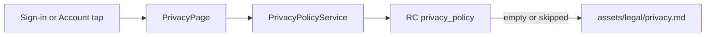

# In-app Privacy Policy

Write a **new** Stackmint-wide Privacy Policy (not a copy of [privacy.zanderkotze.co.za](https://privacy.zanderkotze.co.za/)). That page is a generator template for **Multichoice** (location, under-13, affiliates) and does not match Sprout.

Canonical public URL later: `https://privacy.stackmint.app/` (covers Stackmint apps/sites). **This task is in-app only** — same pattern as Terms: bundled file + Firebase RC. You publish the site yourself when DNS is ready.

Operator stays **Stackmint** (trading name, South Africa). Contact stays **[hello@stackmint.app](mailto:hello@stackmint.app)** (same as Terms).

This is not legal advice. Same CPA/POPIA honesty as Terms: do not claim data practices we do not have (no location, no Firebase Analytics/Crashlytics in the app today).

## Policy content ([sprout_app/assets/legal/privacy.md](sprout_app/assets/legal/privacy.md))

Plain language, headings + bullets, no tables. Last updated: 19 August 2026.

- **Scope** — Stackmint apps and services (currently **Sprout**). A public copy is intended at privacy.stackmint.app; until then the in-app version is the current policy.
- **Who we are** — Stackmint, South Africa; POPIA responsible party; contact email.
- **What we collect** — account identifiers (email, display name / Google profile name); content you enter in Sprout (accounts, goals, transactions); technical data our processors need to run sign-in and sync (e.g. IP at their edge). **Not** location. **Not** card numbers (Play / RevenueCat).
- **Why** — provide the app, authenticate, optional cloud sync, optional Premium.
- **Who we share with** — processors: Supabase, Google (sign-in + Firebase Remote Config), RevenueCat when Premium is enabled. We do not sell personal information. Google’s own policy applies to Google sign-in.
- **Where** — processors may handle data outside South Africa; we still remain the responsible party under POPIA.
- **Retention / deletion** — while the account exists; in-app delete account (and email us).
- **Your rights** — POPIA: access, correction, deletion; complaint to the Information Regulator (South Africa).
- **Children** — 18+ (match Terms), not the old “under 13” COPPA clause.
- **Changes** — in-app / RC updates; continued use after an update.

Register the asset in [sprout_app/pubspec.yaml](sprout_app/pubspec.yaml).

Shorten **Your information** in [sprout_app/assets/legal/terms.md](sprout_app/assets/legal/terms.md) to a pointer at this Privacy Policy (keep the “not a bank” Terms as-is).

## In-app wiring (mirror Terms)

Reuse the Terms load pattern; do not open a browser.

- New RC key `privacy_policy` on [RemoteConfigKeys](sprout_app/lib/core/flags/remote_config_service.dart) (empty default, same as `terms_of_service`).
- New `PrivacyPolicyService` next to [terms_of_service_service.dart](sprout_app/lib/features/auth/application/terms_of_service_service.dart) (same RC-or-asset load).
- New `PrivacyCubit` + `PrivacyPage` cloned from [terms_cubit.dart](sprout_app/lib/features/auth/presentation/bloc/terms_cubit.dart) / [terms_page.dart](sprout_app/lib/features/auth/presentation/terms_page.dart) (pages stay UI-only).
- Register in [service_locator.dart](sprout_app/lib/core/di/service_locator.dart); export from [export.dart](sprout_app/lib/features/auth/export.dart).
- [AppStrings](sprout_app/lib/core/constants/app_strings.dart): `privacyPolicy`, `privacyLoadFailed`; sign-in footer becomes Terms **and** Privacy Policy (two tappable links).
- [sign_in_page.dart](sprout_app/lib/features/auth/presentation/sign_in_page.dart) and [account_page.dart](sprout_app/lib/features/auth/presentation/account_page.dart): Privacy next to Terms (`MaterialPageRoute` → `PrivacyPage`).

## Tests / docs

- Service tests like [terms_of_service_service_test.dart](sprout_app/test/auth/terms_of_service_service_test.dart) (bundled vs remote).
- Sign-in + Account: tapping Privacy opens `PrivacyPage`.
- [docs/SUPABASE_AUTH_TODOS.md](docs/SUPABASE_AUTH_TODOS.md) §7: add `privacy_policy` RC paste (same markdown as the bundled file).

Then `cd sprout_app && flutter analyze && flutter test`. If tests fail or hang, ship the feature and report — do not loop.

## Out of scope

- Hosting/DNS for privacy.stackmint.app or editing privacy.zanderkotze.co.za.
- Opening the public URL from the app.
- go_router (still `MaterialPageRoute` like Terms).
- Lawyer review.

## Human action required

1. Dev Firebase RC: add string `**privacy_policy**`, paste `sprout_app/assets/legal/privacy.md`, publish.
2. When ready, publish that same markdown at privacy.stackmint.app (you own DNS/hosting).
3. Device: Sign-in footer + Account → Privacy Policy, confirm copy and `hello@stackmint.app`.

