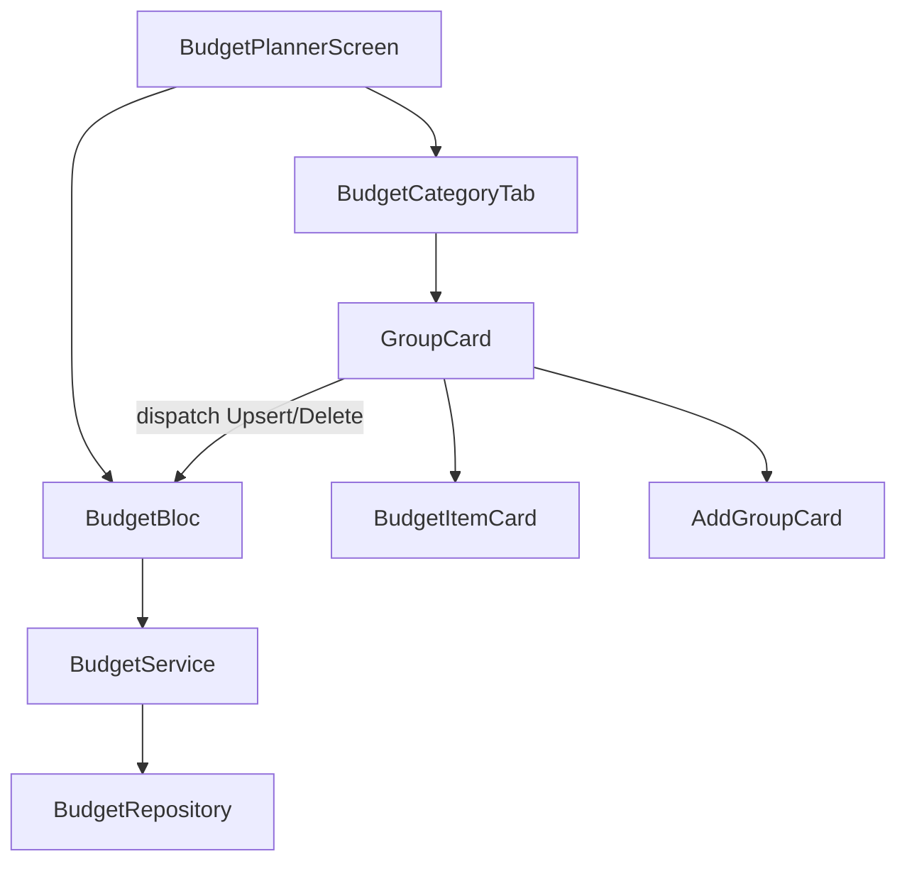

## Goals
- Remove the floating “+” action for Master Budget.
- Add an inline **“Tap + to add a group”** card at the **bottom of each tab**.
- When “Add Group” is tapped, immediately insert a **new expanded group card** in-place that allows editing **title + description**.
- Inside an expanded group, render items as **lighter mini-cards**; tapping item title/value edits inline and **persists when focus leaves** (no explicit Save/Cancel).
- Long-press on an item deletes it (with a lightweight confirm to prevent accidents).
- Keep expand/collapse behavior and keep group + budget totals correct.

## Current code touchpoints (what we’ll build on)
- Floating button is hard-coded in `[sprout_app/lib/features/budget/presentation/budget_planner_screen.dart](sprout_app/lib/features/budget/presentation/budget_planner_screen.dart)` via `floatingActionButton: EnticingAddButton(...)`.
- Groups are already expandable cards using `ExpansionTile` in `[sprout_app/lib/features/budget/presentation/widgets/group_card.dart](sprout_app/lib/features/budget/presentation/widgets/group_card.dart)`.
- Data model supports `BudgetGroup.items` and totals are computed in `BudgetReady.fromGroups(...)` in `[sprout_app/lib/features/budget/presentation/budget_bloc.dart](sprout_app/lib/features/budget/presentation/budget_bloc.dart)`.

## UX decisions (defaults based on your feedback)
- **Auto-save on blur**: for group title/description and item name/value, we’ll persist on focus loss with a small debounce to avoid over-saving.
- **Delete on long-press**: long-press an item shows a small confirm (Dialog/BottomSheet) then dispatches delete.
- **New group creation**: tapping “Add Group” inserts a draft group card already expanded; we only persist once the group has a valid non-empty name (because `BudgetService.saveBudgetGroup` rejects empty names).

## Implementation outline
- **Remove FAB**
  - Update `[sprout_app/lib/features/budget/presentation/budget_planner_screen.dart](sprout_app/lib/features/budget/presentation/budget_planner_screen.dart)` to remove `floatingActionButton`/`floatingActionButtonLocation`.

- **Add inline “Add Group” card per tab (bottom of list)**
  - Introduce a small widget (new file) like `[sprout_app/lib/features/budget/presentation/widgets/add_group_card.dart](sprout_app/lib/features/budget/presentation/widgets/add_group_card.dart)` that looks like a card with “Tap + to add a group”.
  - Update `_BudgetCategoryTab` to always render:
    - the group cards
    - then the AddGroupCard as the last list item

- **Inline group creation + editing in `GroupCard`**
  - Extend `GroupCard` API to accept callbacks for:
    - `onUpsertGroup(BudgetGroup updated)`
    - `onDeleteGroup(String groupId)`
    - `onUpsertItem(String groupId, BudgetItem item)`
    - `onDeleteItem(String groupId, String itemId)`
  - Convert `GroupCard` to `StatefulWidget` so it can manage “editing mode” for title/description and track focus.
  - Title/description display:
    - Non-editing: show `Text`.
    - Editing: show `TextField` inline.
    - On focus lost: validate and dispatch `BudgetGroupUpsertRequested`.

- **Item mini-cards with inline edit + blur persist**
  - Add a widget like `[sprout_app/lib/features/budget/presentation/widgets/budget_item_card.dart](sprout_app/lib/features/budget/presentation/widgets/budget_item_card.dart)`.
  - Render each item as a lighter card (lower elevation/softer border) inside the expanded group.
  - Tapping name/value turns that field into a `TextField`.
  - On blur:
    - parse amount safely (support empty/invalid as “don’t save yet”)
    - prevent negative amounts (align with `BudgetService`)
    - dispatch `BudgetItemUpsertRequested`.
  - Long-press:
    - show confirm
    - dispatch `BudgetItemDeleted`.

- **“Add item” row/card inside expanded group**
  - At the end of expanded content, show a lightweight “+ Add item” card.
  - When tapped: insert a draft item editor card (still within the group) and focus the name field.
  - Persist when user taps away (same blur rules).

- **Wire callbacks from screen to bloc**
  - In `[sprout_app/lib/features/budget/presentation/budget_planner_screen.dart](sprout_app/lib/features/budget/presentation/budget_planner_screen.dart)`, pass handlers to `GroupCard` that call `context.read<BudgetBloc>().add(...)`.

## Edge cases to handle
- **Duplicate group names**: `BudgetService.saveBudgetGroup` can throw; we’ll surface this with a `SnackBar` and keep focus/edit state so the user can correct.
- **Draft group/item not saved**: if user abandons without entering a valid name (or valid amount), draft stays local only and is removed when unfocused/empty.
- **Totals**: no special handling needed; totals are already derived from saved `BudgetGroup.items`, so UI updates automatically after bloc stream emits.

## Files we’ll likely create/modify
- Modify:
  - `[sprout_app/lib/features/budget/presentation/budget_planner_screen.dart](sprout_app/lib/features/budget/presentation/budget_planner_screen.dart)`
  - `[sprout_app/lib/features/budget/presentation/widgets/group_card.dart](sprout_app/lib/features/budget/presentation/widgets/group_card.dart)`
- Add (new widgets):
  - `[sprout_app/lib/features/budget/presentation/widgets/add_group_card.dart](sprout_app/lib/features/budget/presentation/widgets/add_group_card.dart)`
  - `[sprout_app/lib/features/budget/presentation/widgets/budget_item_card.dart](sprout_app/lib/features/budget/presentation/widgets/budget_item_card.dart)`

