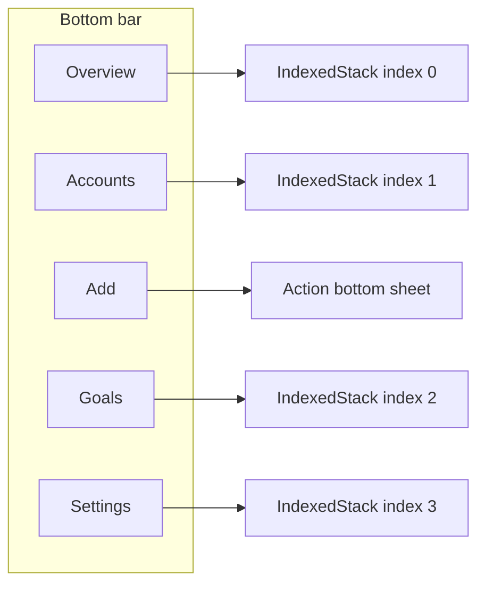

# Overview + Accounts tab information architecture

## Recommendation (navigation)

Keep the **center +** as the third slot in the bar by using **five touch targets**: **Overview | Accounts | Add | Goals | Settings**. That gives **two items on each side** of the add control so it stays visually centered and the layout stays predictable on phones.

**Alternative (not recommended for your concern):** Overview | Accounts | Add | Goals (four outer items) leaves **two tabs left** and **one right** of +, so the + reads off-center. A **Profile/Settings** (or “More”) slot on the right fixes that without moving +.

## Content split

| Tab          | Responsibility                                                                                                                                                                                                                                                |
| ------------ | ------------------------------------------------------------------------------------------------------------------------------------------------------------------------------------------------------------------------------------------------------------- |
| **Overview** | Portfolio total, last updated, **shortcuts** (e.g. Deposit, New account, New goal — can open same flows as today’s + sheet), optional **recent activity**                                                                                                     |
| **Accounts** | Same list UX as [goals_page.dart](sprout_app/lib/features/goals/presentation/goals_page.dart): section title, `ColoredEntityCard` list, empty state, tap → [account_detail_page.dart](sprout_app/lib/features/accounts/presentation/account_detail_page.dart) |
| **Goals**    | Unchanged behavior; still [goals_page.dart](sprout_app/lib/features/goals/presentation/goals_page.dart)                                                                                                                                                       |
| **Settings** | v1: lightweight placeholder (app name, optional “About”, placeholder rows for future theme/sync/debug). Avoid scope creep unless you explicitly want `package_info_plus`, Supabase status, etc.                                                               |

## Code changes (high level)

1. **[shell_page.dart](sprout_app/lib/features/shell/presentation/shell_page.dart)**
  - Replace `_pageIndex` with an explicit selection model, e.g. `enum ShellDestination { overview, accounts, goals, settings }` plus “none” for when only the sheet opens, **or** keep `int` with mapping `0..3` → four `IndexedStack` children (center never changes index).  
  - Bottom `Row`: **four** `Expanded(_ShellTabItem)` + center `**_EnticingAddButton`** (or current add widget) in fixed `Padding`, order as above.  
  - `IndexedStack` children: `[OverviewPage(), AccountsPage(), GoalsPage(), SettingsPage()]`.  
  - Preserve offline banner + `SafeArea` behavior.
2. **Overview page**
  - New file e.g. [overview_page.dart](sprout_app/lib/features/home/presentation/overview_page.dart) (or rename mentally from “home”): move **portfolio header** from current [home_page.dart](sprout_app/lib/features/home/presentation/home_page.dart) here; **remove** the accounts `SliverList` from this screen.  
  - Add a **shortcuts** row/section (2–3 `FilledButton.tonal` / tappable cards) that call the same modals as `_openActions` (deposit, account form, goal form) — optionally extract `_openActions` to a small mixin, `ShellActions` callback, or static helper to avoid duplicating sheet code between shell and overview.
3. **Accounts page**
  - New [accounts_page.dart](sprout_app/lib/features/accounts/presentation/accounts_page.dart) patterned after [goals_page.dart](sprout_app/lib/features/goals/presentation/goals_page.dart): `BlocBuilder<HomeBloc, HomeState>`, `HomeReady.accounts`, same cards and navigation as today’s home list.  
  - `RefreshIndicator` / `CustomScrollView` parity with goals for pull-to-refresh (reuse `HomeSubscriptionRequested`).
4. **Settings page**
  - New minimal [settings_page.dart](sprout_app/lib/features/settings/presentation/settings_page.dart) (or under `shell/presentation/`) with a simple `ListView` of placeholder tiles.
5. **State / “recent activity” (optional phase 2)**
  - Today [home_bloc.dart](sprout_app/lib/features/home/presentation/home_bloc.dart) only combines `watchAccounts()` + `watchPortfolioSummary()`.  
  - To show **recent deposits** on Overview: add a third subscription to `TransactionsService.watchTransactions()`, derive last *N* by `occurredAt`, extend `HomeReady` with `List<Transaction> recent` (or a dedicated `OverviewState` if you rename the bloc).  
  - Keep **one bloc** in `app.dart` if Overview + Accounts both need the same streams (avoids duplicate watchers).
6. **Strings & routing helpers**
  - [app_strings.dart](sprout_app/lib/core/constants/app_strings.dart): add `tabOverview`, `tabAccounts`, `tabSettings` (and consider renaming `tabHome` → `tabOverview` or deprecating).  
  - [app_tab.dart](sprout_app/lib/core/routing/app_tab.dart): replace/extend enum to match four destinations + center action (or delete if unused after shell owns routing).
7. **Cleanup**
  - Remove or repurpose [home_page.dart](sprout_app/lib/features/home/presentation/home_page.dart): either delete after split or keep as a thin export re-exporting `OverviewPage` during migration.
8. **Tests**
  - Update [widget_test.dart](sprout_app/test/widget_test.dart) if it assumes two-tab shell; smoke-test pump still finds material app.

## Implementation order

1. Add `AccountsPage`, `SettingsPage`, `OverviewPage`; wire `IndexedStack` + five-slot bar (shell only).
2. Move portfolio UI off old `HomePage` into `OverviewPage`; delete old home body duplication.
3. Optional: recent activity via `HomeBloc` + `watchTransactions()`.
4. Polish: empty states on Overview (“use + or shortcuts”), tab labels, semantics.

## Notes

- **Renaming `HomeBloc`**: optional; if it feeds both Overview and Accounts, a later rename to `DashboardBloc` improves clarity but is not required for the first pass.  
- **+ button behavior**: unchanged — still opens the same action sheet from [shell_page.dart](sprout_app/lib/features/shell/presentation/shell_page.dart); Overview shortcuts duplicate entry points only.
- For the settings, we can give the user a color picker to choose their own colors? 

