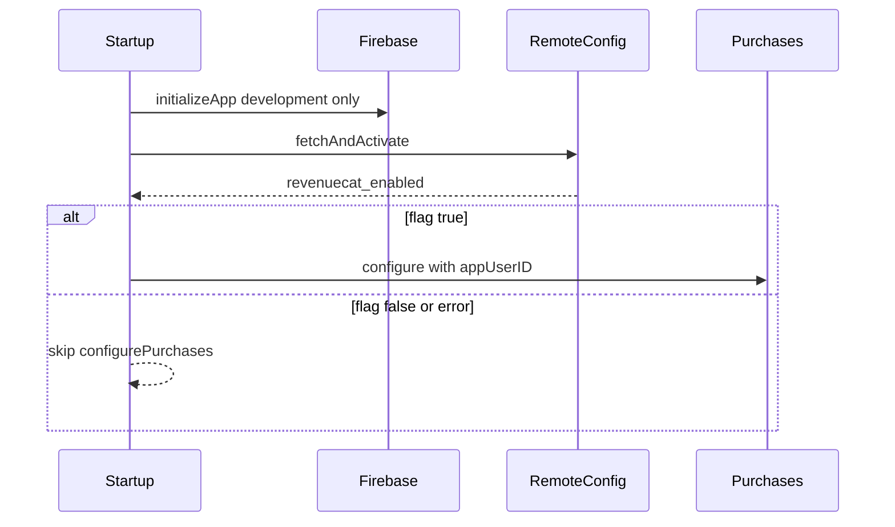

# RevenueCat Remote Config kill switch

## Context

- Foundation only: no Sprout paywall UI; dashboard Customers is the proof of identity.
- Firebase today is **native-only** (Analytics/Crashlytics in Gradle). No FlutterFire / Remote Config.
- Decision: flag **fail-closed** — if Remote Config is missing, offline, or false → **do not** configure Purchases (kill switch for testing).

## Behaviour

| Flavor | Remote Config | Purchases.configure |
|--------|---------------|---------------------|
| `development` | Init Firebase + fetch flag `revenuecat_enabled` | Only if flag is `true` |
| `production` | Skip Remote Config for now | Always skip (fail-closed; also avoids Test Store key in prod) |

Default in Firebase Console for `revenuecat_enabled`: **false**. Flip to `true` only when you want to test RC on `[DEV] Sprout`.

## Implementation

### 1. FlutterFire + Remote Config packages

In [`sprout_app/pubspec.yaml`](sprout_app/pubspec.yaml):

- `firebase_core`
- `firebase_remote_config`

Generate FlutterFire options for the **development** Android app (`co.za.zanderkotze.sprout.dev`) via `flutterfire configure` (or hand-write `lib/firebase_options_development.dart` from the existing `android/app/src/development/google-services.json` project). Keep production FlutterFire out of scope for this pass.

### 2. Feature-flag helper

Small module e.g. [`sprout_app/lib/core/flags/remote_flags.dart`](sprout_app/lib/core/flags/remote_flags.dart):

- Constant key: `revenuecat_enabled`
- `Future<bool> isRevenueCatEnabled({required AppEnvironment environment})`
  - If not `development` → return `false`
  - Else: `Firebase.initializeApp` (once), set Remote Config defaults `{ revenuecat_enabled: false }`, short fetch timeout, `fetchAndActivate`, read bool
  - On any error → return `false` and `debugPrint` the reason

### 3. Gate configure in startup

In [`startup_initializer.dart`](sprout_app/lib/core/startup/startup_initializer.dart) inside `_configurePurchases`:

1. If `!config.isRevenueCatConfigured` → skip (unchanged)
2. If `!(await isRevenueCatEnabled(...))` → mark `configurePurchases` **skipped** with detail like `remote flag off`
3. Else configure as today

### 4. Dashboard / docs

- Document in [`docs/REVENUECAT.md`](docs/REVENUECAT.md): create boolean parameter `revenuecat_enabled` (default false) in the **dev** Firebase project Remote Config; how to enable for testing; fail-closed semantics; production still off until a later pass.
- Note: remove / blank `revenueCatAndroidApiKey` in production.json is not required if code never configures prod; keeping the skip is enough.

### 5. Verify

1. Flag false (or unset) → startup shows purchases skipped; no Purchases configure logs.
2. Set flag true in Firebase Console → cold start → configure + customer in RC dashboard.
3. Toggle back to false → next cold start skips configure (hot restart may still show “already configured” from native singleton until process kill).

## Out of scope

- Paywall / entitlement UI
- Production Remote Config / Play `goog_…` keys
- Real-time flag listeners mid-session (fetch once at startup is enough for a kill switch)
