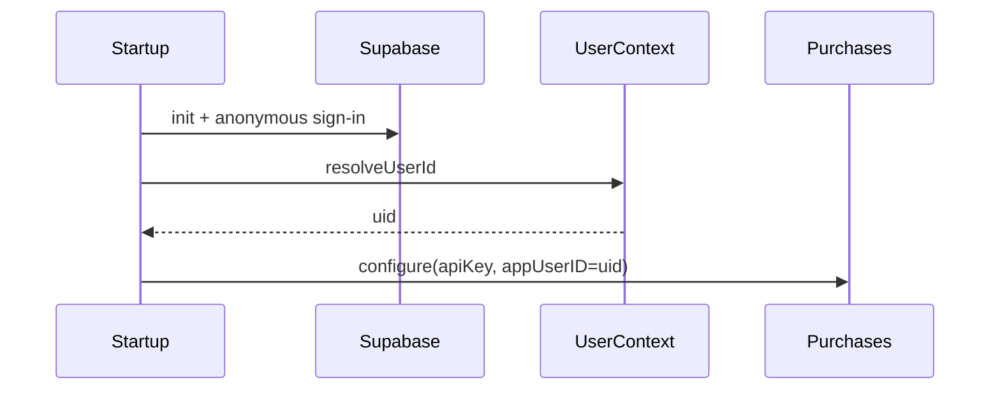

# RevenueCat foundation for Sprout

## Recommendation

Use **freemium + one `premium` entitlement**, unlocked later by **monthly and/or annual** subscriptions.

- One entitlement keeps the app flexible: whatever you gate later (cloud sync limits, advanced budgets, etc.) maps to `premium` without reshaping identity or SDK wiring.
- Subscriptions fit ongoing backend/sync cost better than a one-time unlock for a personal-finance app.
- You do **not** need to decide feature gates now—only the entitlement name. Products/pricing can change in the dashboard without an app rewrite.

Android-only for this pass (no `ios/` folder yet). Dev and prod already use different Play application IDs (`co.za.zanderkotze.sprout.dev` vs `co.za.zanderkotze.sprout`).

## Scope (foundation only)

**In:** RevenueCat project + Test Store catalog stub, `purchases_flutter`, public API keys in env config, `Purchases.configure` + identify with Supabase/Hive user id.

**Out:** Paywall UI, entitlement gating, purchase/restore flows, Play Console / App Store credentials, iOS platform, `purchases_ui_flutter`.

## 1. Dashboard (RevenueCat MCP)

Requires authenticating the RevenueCat MCP (`mcp_auth`) first.

1. `list-projects` — reuse an existing Sprout project if present; otherwise `create-project` named **Sprout**.
2. Use the auto-created **Test Store** app for now (enough to integrate without Play billing credentials).
3. Minimal catalog so offerings are non-empty later:
   - Products: `premium_monthly` (P1M), `premium_annual` (P1Y) on Test Store
   - Entitlement: `premium` → both products
   - Offering: `default` (current) with `$rc_monthly` / `$rc_annual` packages
4. `list-app-public-api-keys` for the Test Store app → store the public key (safe for client embeds).
5. Document for later: create separate **Play Store** apps in RC for `co.za.zanderkotze.sprout` and `co.za.zanderkotze.sprout.dev` once Play Console products + service-account credentials exist; then swap JSON keys from Test Store → `goog_…` per flavor.

## 2. App config

Extend the existing JSON + dart-define pattern in [`sprout_app/lib/core/config/app_config.dart`](sprout_app/lib/core/config/app_config.dart) (same style as Supabase):

- Add `revenueCatAndroidApiKey` to [`assets/config/development.json`](sprout_app/assets/config/development.json) and [`assets/config/production.json`](sprout_app/assets/config/production.json).
- Optional override: `--dart-define=REVENUECAT_ANDROID_API_KEY=…` (CI).
- `isRevenueCatConfigured` when the key is non-empty; skip configure when empty (local-only / unconfigured, mirrors Supabase).

## 3. SDK install + startup wiring

- Add `purchases_flutter` to [`sprout_app/pubspec.yaml`](sprout_app/pubspec.yaml) (pin latest stable from GitHub releases).
- Confirm Android `minSdk` ≥ 21 (already via Flutter defaults).
- After `UserContext.resolveUserId()` in [`startup_initializer.dart`](sprout_app/lib/core/startup/startup_initializer.dart) (user id is stable by then):
  - If configured: `Purchases.setLogLevel(LogLevel.debug)` when `environment == development` (or `kDebugMode`); otherwise info/warn.
  - `await Purchases.configure(PurchasesConfiguration(apiKey)..appUserID = resolvedUserId)`.
  - Soft-fail on configure errors in non-strict paths so startup still completes (log clearly).
- Add a small `StartupStep` (e.g. `configurePurchases`) for progress UI consistency.

Identity rule: use the same opaque id as [`UserContext`](sprout_app/lib/core/user/user_context.dart) (Supabase auth uid when available)—never email. No `logOut` needed yet (anonymous Supabase session stays for the device).

## 4. Verify

1. Run development flavor; confirm log banner: `Purchases is configured`.
2. In RevenueCat dashboard Customers, the app user id matches the Supabase/Hive uid (not `$RCAnonymousID:`).
3. No auth errors when the SDK first talks to the API (wrong key shows quickly).

## 5. Follow-ups (not this pass)

- Play Console products + RC Play apps + RTDN for real billing
- `revenuecat-paywall` / purchase flow / entitlement gate once product direction is clearer
- iOS when `flutter create` / platform folder is added (`appl_…` key + Platform branch)
- Optional: `Purchases.logIn` on future real account linking if anonymous → named auth lands
