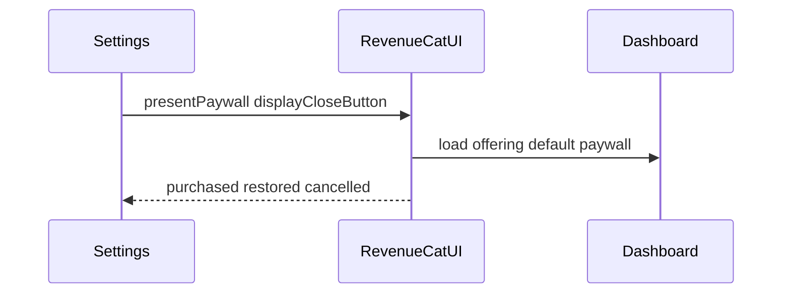

# RevenueCat paywall (Settings + RevenueCatUI)

## Approach

Use **RevenueCatUI** (dashboard template), not a custom Flutter paywall. Present it from **Settings** via `RevenueCatUI.presentPaywall`. Do **not** gate features this pass—freemium stays fully usable; Premium is opt-in from Settings.

Prerequisite: Purchases must already be configured (dev Remote Config `revenuecat_enabled=true` + non-empty API key). If configure was skipped, hide the Upgrade tile.

## 1. Dashboard paywall (no paywall today)

Project `proj8bd5ebcf`, offering `default` (`ofrng04b0fe62db`) has packages but `paywall_id: null`.

- Run `create-paywall-ai` against that offering (Sprout savings app, teal seed `#0D9488`, monthly/annual, entitlement `premium`).
- Poll `get-paywall-ai-task` until the draft exists.
- **Human:** review the draft in the [RevenueCat paywall editor](https://app.revenuecat.com/), then approve publish (agent will call `publish-paywall` only after you say so—never publish blindly).

Without a published attached paywall, the SDK falls back to a generic layout.

## 2. App package

In [`sprout_app/pubspec.yaml`](sprout_app/pubspec.yaml), add `purchases_ui_flutter` at the same major as existing `purchases_flutter: ^10.4.3`, then `flutter pub get`. Android-only for now (no `ios/`).

## 3. Thin purchases presentation helper

Add a small module under e.g. [`sprout_app/lib/features/purchases/`](sprout_app/lib/features/purchases/) (presentation-focused; no full domain layer needed yet):

- Constant `kPremiumEntitlementId = 'premium'`.
- `Future<bool> isPurchasesReady()` — `Purchases.isConfigured` (safe when kill switch skipped configure).
- `Future<bool> hasPremium()` — `customerInfo.entitlements.active['premium']`.
- `Future<PaywallResult> presentPremiumPaywall()` — `RevenueCatUI.presentPaywall(displayCloseButton: true)` (RevenueCatUI owns purchase/restore; do not call `purchasePackage` alongside).

## 4. Settings CTA

In [`settings_page.dart`](sprout_app/lib/features/settings/presentation/settings_page.dart):

- Top tile: **Upgrade to Premium** / **Sprout Premium** (subtitle reflects active vs not after a quick entitlement check).
- On tap: present paywall; after `purchased` / `restored`, refresh tile state (and optionally a short SnackBar).
- If purchases not configured: omit the tile (or show disabled “Subscriptions unavailable”) so kill-switch / local-only builds stay clean.
- Optional **Restore purchases** as a secondary action on the same tile’s subtitle flow or a small trailing control—RevenueCatUI already exposes restore on the paywall; a separate Settings restore is nice-to-have and can use `Purchases.restorePurchases()` if we add it.

## 5. Docs

Update [`docs/REVENUECAT.md`](docs/REVENUECAT.md): paywall package, Settings entry point, entitlement id, verify steps (flag on → Upgrade → Test Store purchase → Customer shows `premium`).

## 6. Verify (agent + human device)

1. Dev flavor, `revenuecat_enabled=true`, cold start with Purchases configured.
2. Settings → Upgrade → dashboard template (not fallback) with monthly/annual.
3. Test Store purchase → `PaywallResult.purchased` → tile shows Premium active; RC Customers shows entitlement.
4. Dismiss without buying → cancelled; app still usable.
5. Flag off / empty key → no Upgrade tile (or unavailable).

## Out of scope

- Feature gating any screen behind `premium`
- Custom paywall widgets
- Production Remote Config / Play `goog_…` keys
- iOS
- Auto-present on first launch
