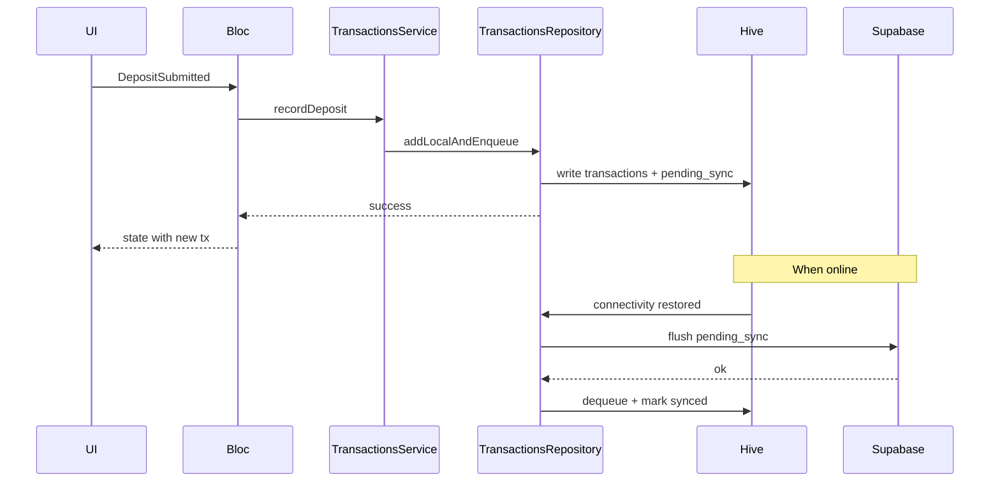

# Sprout: structure, models, and build order

## Current repo state

- Flutter package lives at [sprout_app/pubspec.yaml](sprout_app/pubspec.yaml) (name: `sprout`); only `cupertino_icons` beyond the SDK.
- [sprout_app/lib/main.dart](sprout_app/lib/main.dart) is still the counter template and currently has **invalid Dart** (`ColorScheme` / `MainAxisAlignment` prefixes missing on `.fromSeed` / `.center`). The first implementation step should replace this with `bootstrap` + `App` wiring, not patch the demo in place.

## 1. Dependencies (`pubspec.yaml`)

**Runtime**


| Package                 | Role                                                                          |
| ----------------------- | ----------------------------------------------------------------------------- |
| `flutter_bloc`          | BLoC/Cubit; strict UI/logic split                                             |
| `equatable`             | Value equality for states/events (optional: `freezed` later)                  |
| `get_it`                | Service locator for repositories, services, data sources                      |
| `supabase_flutter`      | Auth + Postgres sync                                                          |
| `hive` / `hive_flutter` | Local boxes: entities + `pending_sync` queue                                  |
| `connectivity_plus`     | Offline indicator + sync trigger                                              |
| `intl`                  | ZAR formatting (`NumberFormat.simpleCurrency(name: 'ZAR')` or locale `en_ZA`) |
| `uuid`                  | Client-generated IDs for offline-created rows                                 |
| `path_provider`         | Hive path (if not using default)                                              |


**Dev**


| Package          | Role                                 |
| ---------------- | ------------------------------------ |
| `build_runner`   | Code generation                      |
| `hive_generator` | `@HiveType` adapters for Hive models |
| `flutter_lints`  | Already present                      |


**Optional (nice later, not required for v1)**

- `go_router` + typed routes (still keep route **names/paths in core constants**).
- `injectable` + `injectable_generator` if you outgrow manual `get_it` registration.
- `fpdart` if you want `Either<Failure, T>` everywhere; otherwise a small sealed `Failure` + try/catch at repository boundaries is enough.

## 2. Clean Architecture folder tree (feature-first)

Feature-first keeps boundaries clear while matching **UI → BLoC → Service → Repository → Data source**. Shared kernel in `core/`.

```text
lib/
  app.dart                    # MaterialApp, theme, router shell
  bootstrap.dart              # Hive.init, Supabase.init, register DI, runApp
  core/
    constants/                # app_strings, app_colors (tokens), dimensions, route_paths
    di/                       # service_locator.dart (GetIt setup)
    error/                    # AppException, Failure mapping, global handler hook
    routing/                  # shell route / nav index enum
    theme/                    # ColorScheme, component themes (premium vivid palette)
    utils/                    # money_format.dart (ZAR), date_format.dart
  features/
    shell/                    # root scaffold: bottom nav + center + action sheet host
    connectivity/             # ConnectivityCubit/Bloc + subtle banner/icon
    accounts/
      domain/                 # Account entity, AccountsRepository interface
      data/                   # DTOs, mappers, hive + supabase datasources, repo impl
      application/            # AccountsService (optional thin orchestration)
      presentation/           # blocs, pages, widgets (account cards, detail tx list)
    goals/
      domain/                 # Goal entity, GoalsRepository interface
      data/
      application/
      presentation/           # goal cards, progress, detail tx list
    transactions/
      domain/                 # Transaction entity, aggregate rules (saved per goal)
      data/                   # local write path + pending_sync box + sync metadata
      application/            # TransactionsService + SyncService (or split sync feature)
      presentation/           # deposit flow, add-goal flow (can live under shell)
    sync/                     # optional: dedicated SyncCubit listening to connectivity
```

**Enums (examples, live next to the layer that owns them or under `core/enums/`):** `AppTab` (home / goals / center), `NavDestination`, `SyncQueueOperationType`, `PendingSyncStatus`, `RepositoryResult` / loading states in BLoC only (not duplicated as domain enums unless they mean business rules).

## 3. Domain models and Supabase/Hive mapping

Use **integer minor units** (cents) end-to-end in domain/data to avoid float drift; format to ZAR only in presentation.

### Relational schema (Supabase)

- `**accounts`**: `id` (uuid, PK), `user_id` (uuid, FK to `auth.users`), `name` (text), `color` (int, e.g. `0xFF...`), `created_at`, `updated_at`.
- `**goals`**: `id`, `user_id`, `name`, `target_amount_cents` (bigint), `color` (int), `created_at`, `updated_at`.
- `**transactions**`: `id`, `user_id`, `account_id` (FK), `goal_id` (FK), `amount_cents` (bigint, positive for deposits), `occurred_at` (timestamptz), optional `note`, `created_at`.

Enable **RLS** on all three: `user_id = auth.uid()` for select/insert/update/delete.

**Portfolio total / last updated**

- **Total**: sum of `amount_cents` over all transactions for the user (or sum per account on Home—spec implies one portfolio total; use global sum unless you later split “per account balance”).
- **Last updated**: `max(occurred_at)` across transactions, or `max(updated_at)` on accounts/goals if you allow edits—simplest is `max(transactions.occurred_at)` after any deposit.

**Goal progress**

- `saved_cents = sum(transactions.amount_cents where goal_id = goal.id)`.
- `remaining_cents = max(0, target_amount_cents - saved_cents)`.
- `percent = target > 0 ? min(100, saved * 100 / target) : 0`.

### Hive

- **Boxes**: `accounts`, `goals`, `transactions`, `pending_sync` (queue).
- **Adapters**: `@HiveType` on **local DTOs** (not necessarily identical to domain entities): e.g. `AccountHiveModel`, `GoalHiveModel`, `TransactionHiveModel`, `PendingSyncOperationHiveModel`.
- **Offline deposit flow**: append row to `transactions` box immediately (with `is_pending_sync: true` or separate field on DTO); append same payload to `pending_sync` queue. **Sync service** on connectivity restored: dequeue, `insert` to Supabase, on success remove from queue and flip local sync flag / replace temp uuid with server id if you use server-generated ids (prefer **client uuid** as PK everywhere for simpler merge).

### Draft Dart shapes (domain layer — conceptual)

```dart
// domain/account.dart
class Account {
  final String id;
  final String name;
  final int color; // ARGB
  final DateTime createdAt;
  final DateTime updatedAt;
}

// domain/goal.dart
class Goal {
  final String id;
  final String name;
  final int targetAmountCents;
  final int color;
  final DateTime createdAt;
  final DateTime updatedAt;
}

// domain/transaction.dart
class Transaction {
  final String id;
  final String accountId;
  final String goalId;
  final int amountCents;
  final DateTime occurredAt;
  final String? note;
  final bool pendingSync; // true until pushed
}
```

Repository interfaces return `Stream`/`Future` of domain types; data layer maps Supabase rows and Hive DTOs ↔ domain.

## 4. Key flows (mermaid)




## 5. UI/navigation notes

- **Bottom bar**: three visual slots — Home, center `+` (not a standard `BottomNavigationBar` index; use a custom bar or `BottomAppBar` + centered `FloatingActionButton`/`InkWell`), Goals.
- **Center action**: `showModalBottomSheet` with two primary actions: “New goal” / “Deposit” (deposit: pick Account, Goal, Amount).
- **Cards**: shared `ColoredEntityCard` driven by `color` + theme tokens from [core/theme](sprout_app/lib/core/theme/) for a premium, vivid look.
- **Offline**: `ConnectivityBloc` at root; `Banner` or `Icon` in `AppBar`/`SafeArea` when disconnected.

## 6. Implementation sequence (bottom-up)

1. **Fix entrypoint**: `bootstrap.dart` (async init: Hive, Supabase from env/`--dart-define`, `GetIt`), `app.dart`; delete counter demo usage.
2. **Core**: constants (strings, routes), theme (seed + card styles), `AppException` / mapping, ZAR `intl` helper.
3. **DI**: register abstract repos + impls + services + Supabase/Hive singletons.
4. **Domain**: entities + repository contracts for accounts, goals, transactions (+ optional `PortfolioSummary` read model with `totalCents`, `lastUpdatedAt`).
5. **Data**: Hive DTOs + adapters (`build_runner` / `hive_generator` per your melos/workspace convention), Supabase REST/RPC wrappers, repository implementations that **read-through** local first then merge remote (v1 can be “local is source of truth when offline; on login fetch remote and replace” — document chosen merge rule).
6. **Sync**: `SyncService` subscribed to `connectivity_plus` stream; processes `pending_sync` FIFO; retries with backoff; surfaces failures via `SyncCubit` or transaction bloc states.
7. **Application services**: thin orchestration if one deposit touches transaction + portfolio cache invalidation.
8. **BLoCs**: `HomeBloc`, `GoalsBloc`, `AccountDetailBloc`, `GoalDetailBloc`, `DepositBloc`, `GoalFormBloc`, connectivity/sync blocs — events map to service/repo calls only.
9. **Presentation**: `ShellPage` with bottom nav; Home (total, last updated, account list); Goals (list + progress); detail pages; bottom sheet flows; CRUD screens for account/goal (edit/delete in app bar or swipe).
10. **Supabase project**: SQL migrations for tables + RLS; store URL/anon key via `--dart-define` or `flutter_dotenv` (if you add it).
11. **Tests**: repository unit tests with fake Hive box / mocked Supabase; bloc tests for deposit offline + sync.

## 7. Out of scope for first scaffold (unless you want them in pass 1)

- Full conflict resolution if the same row is edited on two devices.
- Auth UX polish (email magic link, etc.) — still wire `Supabase.instance.client.auth` for `user_id`.
- Withdrawals or transfers between accounts.

This sequence delivers the required **dependencies list**, **folder tree**, **domain model draft + table mapping**, and **ordered build path** aligned with [planning/gemini/cursor_prompt.md](planning/gemini/cursor_prompt.md) and the existing [sprout_app/](sprout_app/) package.