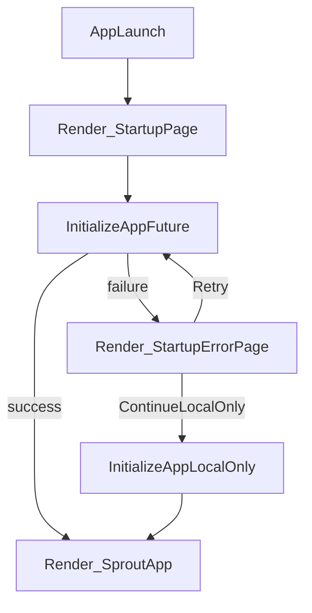

# Startup screen + config loading plan

## What’s happening now (root cause)
- `bootstrap()` does **all initialization before `runApp()`**.
- If anything hangs/throws before `runApp()` (notably `AppConfig.load()`), Android shows a **black screen**.
- In this repo, `pubspec.yaml` declares assets `assets/config/development.json` and `assets/config/production.json`, but those files are currently **missing**. That will cause `rootBundle.loadString(...)` to throw in release, before the first frame.

## Goal
- Render a **StartupPage immediately**.
- Run init async in the background.
- If init succeeds, transition to the real app.
- If config is missing/invalid (or any init fails), show a **StartupErrorPage** that:
  - shows a short human-friendly message
  - shows a **diagnostic progress list** (your preference)
  - offers actions: **Retry**, and **Continue local-only** (developer-friendly during active development)

## Approach (minimal churn, robust)
- Refactor `bootstrap()` into two layers:
  - **UI layer** (runs immediately): `runApp(SproutBootstrapApp(...))`
  - **init layer** (future): `initializeApp(configAssetPath)` that performs the current Hive/DI/Supabase/migrate/sync work.
- Convert the current `runApp(const SproutApp())` at the end of `bootstrap()` into a **navigation/state switch** inside the bootstrap UI.
- Implement progress reporting with a simple enum + state updates so the startup page can show:
  - Hive init / box opens
  - config load
  - Supabase init + anonymous auth
  - DI configure
  - user context resolve
  - migration
  - pending sync flush
  - initial remote pull

### Suggested state machine

## Concrete file changes
- Update entrypoints to render immediately:
  - `sprout_app/lib/main.dart`
  - `sprout_app/lib/main_development.dart`
  - `sprout_app/lib/main_production.dart`
- Refactor init logic:
  - `sprout_app/lib/bootstrap.dart`
    - extract `Future<void> initializeApp({required String configAssetPath, required StartupProgressReporter reporter, required bool allowSupabase})`
    - keep a thin `bootstrap()` wrapper only if still useful, otherwise remove.
- Add bootstrap UI widgets:
  - `sprout_app/lib/features/startup/…` (new feature folder)
    - `startup_page.dart` (diagnostic list + spinner)
    - `startup_error_page.dart` (message + details + Retry/Continue buttons)
    - `startup_flow.dart` (StatefulWidget that runs the init future and switches to `SproutApp`)
- Make config load non-fatal by default during development:
  - `sprout_app/lib/core/config/app_config.dart`
    - add `AppConfig.tryLoad(...)` that returns `(config, error)` or throws only when requested
    - keep existing `load()` for strict behavior
- Add the missing asset files so release builds always have *something* to load:
  - `sprout_app/assets/config/development.json` (new)
  - `sprout_app/assets/config/production.json` (new)
  - default values can be empty strings (Supabase disabled) unless you prefer placeholders.

## UX details
- Startup page shows:
  - app name (`AppStrings.appTitle`)
  - short status line (current init step)
  - expandable/collapsible list of steps with checkmarks/spinner
- Error page shows:
  - “We couldn’t finish starting Sprout.”
  - in debug builds: exception text + asset path
  - actions: Retry / Continue local-only

## Verification
- Run a debug build and confirm StartupPage appears instantly.
- Run a release build and confirm:
  - if config assets exist → app boots
  - if config assets are missing/invalid → error page appears (no black screen)

## Notes / assumptions
- “Continue local-only” means we skip Supabase init/pull, but still bring up Hive + app UI so you can keep testing core flows.
- If you later want strict production behavior, we can gate “Continue local-only” behind `kDebugMode` or a dev flag.
