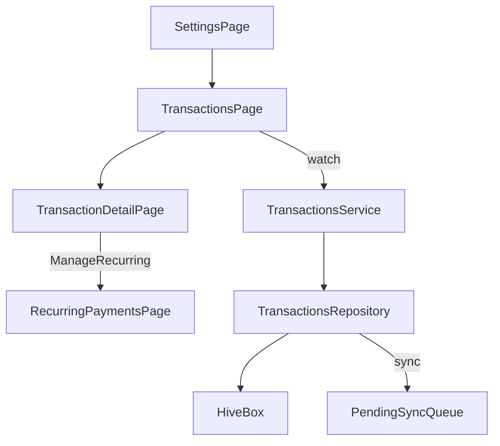

## Scope decisions captured
- Show **deposits + allocations** in the list.
- Add a **group/batch id** to reliably show how a deposit was split across goals.

## UX / Screens
- **TransactionsPage** (from Settings)
  - Card list, newest first.
  - Each card shows:
    - Amount (formatted ZAR)
    - **Kind** (Deposit vs Allocation)
    - **Account name**
    - **Goal**: “Unallocated” when `goalId == null`, otherwise goal name
    - **Date only** (no time)
    - Optional chips/labels: “Recurring” + frequency (when applicable)
  - Tap card → **TransactionDetailPage**.

- **TransactionDetailPage**
  - Show “as much meaningful data as possible”:
    - Amount
    - Kind
    - Local date + time
    - Account name
    - Goal / Unallocated
    - Recurring toggle state + frequency + next scheduled date (if present)
    - Pending sync state
    - **Note**: editable text field (save)
  - **If recurring**: CTA/button “Manage recurring payments” → push `RecurringPaymentsPage`.
  - **Split view** (when `groupId` present):
    - Show the deposit + all allocations in that same group (sum allocations, remaining unallocated from that deposit if any).

## Data model changes (to support split grouping + notes editing)
- Extend transaction model with `groupId` (nullable) to link a deposit and its follow-up allocations made in the same action.
  - Update domain: `[sprout_app/lib/features/transactions/domain/transaction.dart](sprout_app/lib/features/transactions/domain/transaction.dart)`
  - Update Hive model + mapper: `[sprout_app/lib/features/transactions/data/local/transaction_hive_model.dart](sprout_app/lib/features/transactions/data/local/transaction_hive_model.dart)`, `[sprout_app/lib/features/transactions/data/transaction_mapper.dart](sprout_app/lib/features/transactions/data/transaction_mapper.dart)`
  - Update supabase row mapping + sync payload: `[sprout_app/lib/features/transactions/data/transaction_mapper.dart](sprout_app/lib/features/transactions/data/transaction_mapper.dart)`, `[sprout_app/lib/features/transactions/data/pending_sync_payload.dart](sprout_app/lib/features/transactions/data/pending_sync_payload.dart)`
  - Add a migration to add `group_id uuid null` to `public.transactions` (indexed).

- Add repository/service method to update a transaction note.
  - Update repository interface: `[sprout_app/lib/features/transactions/domain/transactions_repository.dart](sprout_app/lib/features/transactions/domain/transactions_repository.dart)`
  - Implement in `[sprout_app/lib/features/transactions/data/transactions_repository_impl.dart](sprout_app/lib/features/transactions/data/transactions_repository_impl.dart)` (update Hive row, mark pendingSync when Supabase configured, enqueue sync op)
  - Expose in `[sprout_app/lib/features/transactions/application/transactions_service.dart](sprout_app/lib/features/transactions/application/transactions_service.dart)`

## Recording grouped “deposit → split allocations”
- In `[sprout_app/lib/features/shell/presentation/deposit_bottom_sheet.dart](sprout_app/lib/features/shell/presentation/deposit_bottom_sheet.dart)`:
  - When mode is `depositToAccountThenAllocate`, generate one `groupId` and pass it to:
    - the initial **account deposit** (unallocated)
    - each subsequent **allocation** transaction
  - When mode is `allocateExistingUnallocated`, also generate a `groupId` for that allocation batch so allocations are viewable as a group.

## Formatting helpers
- Add a date-only formatter (e.g. `formatDate(DateTime dt)`) alongside existing `formatDateTime` in `[sprout_app/lib/core/utils/date_format.dart](sprout_app/lib/core/utils/date_format.dart)`.

## Navigation hook (Settings)
- Add a new Settings `ListTile` to open `TransactionsPage` using the same navigation style already used for `RecurringPaymentsPage`.
  - File: `[sprout_app/lib/features/settings/presentation/settings_page.dart](sprout_app/lib/features/settings/presentation/settings_page.dart)`

## Presentation layer implementation notes
- Implement a bloc similar to `RecurringPaymentsPage` to join:
  - `TransactionsService.watchTransactions()`
  - `AccountsService.watchAccounts()`
  - `GoalsService.watchGoals()`
- Build `accountsById` / `goalsById` maps for names and card display.

## Extra “nice to have” features (low-risk additions)
- **Filters**: by account, by goal, by kind (deposit/allocation), recurring-only.
- **Search**: search note text / account / goal.
- **Quick actions** on detail: “Go to account” / “Go to goal” deep links.
- **Delete transaction** (if you want) with confirmation + sync.

